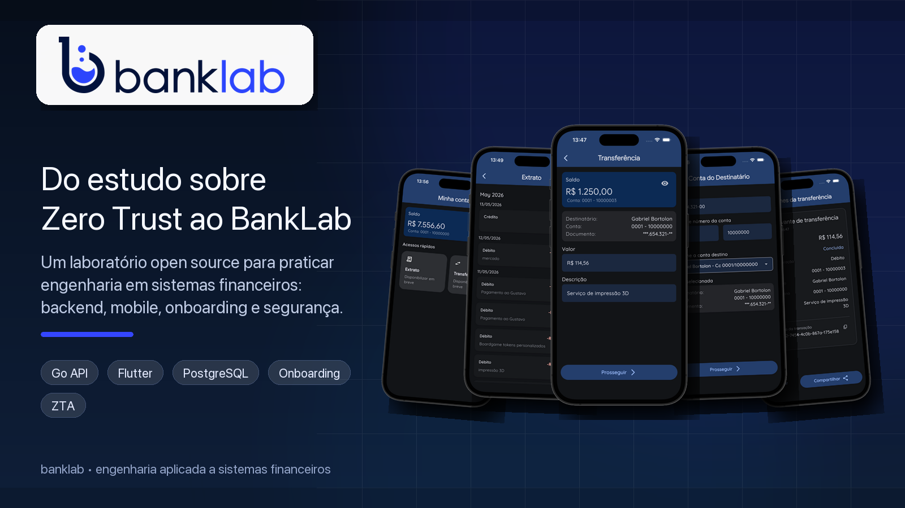

# BankLab

[](https://github.com/rudsonalves/banklab/actions/workflows/ci.yml)

BankLab é um laboratório open source para estudar e praticar engenharia aplicada a sistemas financeiros, unindo **backend em Go**, **app mobile em Flutter**, **consistência transacional**, **onboarding** e evolução futura para **Zero Trust Architecture**.



O projeto nasceu de uma lacuna prática: depois de estudar Zero Trust em aplicações financeiras, faltava um ambiente próprio onde fosse possível transformar pesquisa, artigos e decisões arquiteturais em implementação real, com tempo para errar, revisar, documentar e amadurecer o desenho.

Um domínio bancário, mesmo simplificado, é uma boa base para esse tipo de estudo porque obriga a lidar com problemas que aparecem em sistemas reais: identidade, autenticação, aprovação de usuários, movimentações financeiras, rastreabilidade, contratos de API, integração mobile/backend e fluxos de cadastro que não podem ser tratados como simples formulários.

A ideia central do BankLab é tratar movimentações financeiras como fonte da verdade. O saldo de uma conta não é apenas um número solto: ele deve ser consequência dos registros no ledger, persistidos na tabela `transactions`.

O projeto, atualmente, possui duas aplicações principais:

- **API em Go**: implementa o núcleo bancário, incluindo autenticação, clientes, contas e movimentações financeiras.
- **Mobile em Flutter**: consome a API e valida fluxos ponta a ponta de autenticação, contas e transações.

Este repositório ainda está em evolução. A proposta é que ele sirva como um laboratório prático para estudar backend, mobile, testes, produto financeiro, documentação técnica e colaboração em um projeto com cara de sistema real.

## Objetivo

Construir, de forma incremental, uma base bancária simplificada capaz de:

- cadastrar usuários e clientes;
- aprovar usuários antes do acesso completo;
- abrir e consultar contas;
- registrar movimentações financeiras;
- consultar saldo e extrato;
- realizar transferências internas;
- manter rastreabilidade e consistência dos dados.

O foco não é ter muitas funcionalidades rapidamente. O foco é construir pouco, mas com cuidado: regras claras, testes, documentação e decisões técnicas bem explicadas.

## Princípios do projeto

- **Integridade financeira**: toda alteração relevante deve ser registrada.
- **Atomicidade**: operações críticas, como transferências, devem acontecer por completo ou não acontecer.
- **Rastreabilidade**: mudanças de saldo precisam ser auditáveis.
- **Ledger como autoridade**: os registros em `transactions` são a fonte da verdade para movimentações.
- **Consistência antes de volume**: o projeto privilegia confiabilidade, não quantidade de telas ou endpoints.
- **Arquitetura explícita**: as camadas e responsabilidades devem ser fáceis de entender.

## Escopo atual

| Domínio      | Responsabilidades                                                   |
| ------------ | ------------------------------------------------------------------- |
| Autenticação | registro, login, refresh token, usuário atual e controle por JWT    |
| Usuários     | cadastro, estado de aprovação e fluxo administrativo                |
| Clientes     | criação automática a partir do usuário, CPF e email                 |
| Contas       | abertura, listagem, consulta de saldo e ciclo de vida               |
| Ledger       | depósito, saque, transferência interna e histórico de movimentações |
| Extrato      | listagem paginada de transações por conta                           |
| Mobile       | experiência Flutter integrada com a API                             |

## Fora do escopo por enquanto

- Pix, TED ou integrações bancárias externas;
- antifraude e análise de risco;
- notificações por email, push ou SMS;
- múltiplas moedas;
- conciliação bancária externa;
- processamento assíncrono de transações financeiras.

Esses pontos podem aparecer no roadmap futuro, mas a base precisa ficar sólida primeiro.

## Stack

### API

- Go 1.26.1
- PostgreSQL 17 com `pg_cron`
- `net/http`
- `pgx/v5`
- JWT
- migrations com `golang-migrate`

### Mobile

- Flutter
- Dart SDK ^3.11.4
- `dio`
- `go_router`
- `flutter_secure_storage`
- `auto_injector`

### Infra local

- Docker
- Docker Compose
- imagem PostgreSQL customizada em `infra/docker/postgres`
- Makefile para comandos de desenvolvimento

## Estrutura do repositório

```text
banklab/
├── CHANGELOG.md       # Registro de mudanças no projeto
├── CONTRIBUTING.md    # Diretrizes para contribuições
├── LICENSE            # Licença do projeto
├── Makefile           # Atalhos de desenvolvimento
├── README.md          # Documentação principal em português
├── README_en.md       # Documentação principal em inglês
├── api/               # Backend em Go
├── docker-compose.yml # Configuração PostgreSQL local com pg_cron
├── docs/              # Roadmap, backlogs, decisões e relatórios
├── infra/             # Scripts e configurações de infraestrutura
├── mobile/            # App Flutter BankFlow
├── packages/          # Futuro repositório de pacotes auxiliares
├── templates/         # Templates do pandoc
└── tools/bruno/       # Coleções e apoio para testar a API
```

## O que já existe

### API em Go

- registro, login, refresh token e usuário atual;
- criação automática de cliente durante o cadastro;
- fluxo de aprovação administrativa de usuários pendentes;
- abertura e listagem de contas;
- consulta de saldo;
- transferências internas;
- recibo de transferência;
- extrato paginado;
- persistência append-only das movimentações em `transactions`;
- testes automatizados em módulos importantes.

### Mobile em Flutter

- fluxo de autenticação com JWT;
- tratamento de usuário pendente de aprovação;
- visualização e criação de contas;
- transferência entre contas;
- histórico de transações;
- integração com a API local.

## Como rodar localmente

### Pré-requisitos

- Docker e Docker Compose;
- Go 1.26.1 ou superior;
- Flutter configurado na máquina;
- `golang-migrate`.

No macOS, o `golang-migrate` pode ser instalado com:

```bash
brew install golang-migrate
```

### 1. Subir a API

Na raiz do repositório:

```bash
make run
```

Esse comando valida o Docker, sobe o PostgreSQL, aguarda o banco ficar pronto, aplica as migrations e inicia a API.

Os arquivos `api/dev.env` e `api/staging.env` configuram os ambientes da API.
Os comandos do Make selecionam o arquivo correspondente para o PostgreSQL em
Docker, migrations e inicialização da API no host.

As durações de token podem ser configuradas com `JWT_ACCESS_TOKEN_DURATION` e
`JWT_REFRESH_TOKEN_DURATION`; quando omitidas, a API usa `15m` e `168h`.

O banco local é criado a partir de uma imagem customizada baseada em PostgreSQL 17 com `pg_cron`. A extensão é usada para rotinas agendadas de manutenção do banco, como a limpeza diária de verificações temporárias de contato e de tokens de step-up após a janela operacional de retenção.

URL padrão da API:

```text
http://localhost:8080
```

### 2. Rodar o app mobile

Em outro terminal:

```bash
cd mobile
flutter pub get
flutter run --dart-define-from-file=dev.env
```

Os guias detalhados ficam em:

- [api/docs/00-getting_started.md](api/docs/00-getting_started.md)
- [mobile/docs/00-getting_started.md](mobile/docs/00-getting_started.md)

## Endpoints principais

```text
POST   /auth/register
POST   /auth/login
POST   /auth/refresh
GET    /auth/me

POST   /security/transaction-password
POST   /security/step-up/authorize

POST   /admin/users/{id}/approve
POST   /admin/customers/{customer_id}/accounts

GET    /customers/me

GET    /accounts
GET    /accounts/{id}/balance
GET    /accounts/internal-transfers/recipients
POST   /accounts/internal-transfers
GET    /accounts/transfer/{transaction_reference}/receipt
GET    /accounts/{id}/statement
```

As rotas de registro e login exigem `X-App-Token`. As demais rotas exigem autenticação por JWT. `POST /accounts/internal-transfers` também exige `X-Step-Up-Token` emitido por `POST /security/step-up/authorize` para a operação pública `method=POST` e `path=/accounts/internal-transfers`. Rotas administrativas também exigem um usuário com papel de administrador.

## Comandos úteis

```bash
make help

# ambiente local
make setup
make run
make reset

# API
make api-build
make api-tests

# Mobile
make mobile-tests
make mobile-test-unit

# Todos os testes
make tests

# Docker
make docker-up
make docker-down
make docker-logs
make docker-clean
```

## Como contribuir

O BankLab está aberto para colaboração de pessoas que queiram praticar, aprender e crescer junto com um projeto de engenharia aplicada.

Boas frentes para contribuir:

- **Backend Go**: novos casos de uso, testes, handlers, regras de domínio e melhoria de consistência.
- **Flutter**: telas, navegação, estados de erro, componentes e experiência de uso.
- **Testes**: unitários, integração, cenários de concorrência e cobertura de fluxos críticos.
- **Documentação**: guias de setup, explicação da arquitetura, diagramas e exemplos de uso.
- **Produto financeiro**: modelagem de fluxos, regras de negócio e refinamento do roadmap.
- **Infra e DevEx**: automação, scripts, CI, ambiente local e coleções Bruno.

Para organizar o trabalho, use o padrão descrito em [CONTRIBUTING.md](CONTRIBUTING.md). A ideia é classificar cada tarefa por tipo, área e prioridade, facilitando a entrada de novos colaboradores.

## Sugestões de primeiras contribuições

- revisar o guia de setup e reportar pontos confusos;
- melhorar mensagens de erro no mobile;
- adicionar testes para cenários de transferência;
- criar exemplos de payload para endpoints principais;
- documentar fluxos com diagramas simples;
- melhorar telas de extrato e recibo;
- propor issues pequenas com escopo bem definido.

## Documentação

### Geral

- [CONTRIBUTING.md](CONTRIBUTING.md)
- [docs/README.md](docs/README.md)
- [docs/ROADMAP.md](docs/ROADMAP.md)
- [docs/backlogs/README.md](docs/backlogs/README.md)
- [docs/backlogs/api/000 - pre-onboarding.md](docs/backlogs/api/000%20-%20pre-onboarding.md)
- [docs/backlogs/api/001 - onboarding.md](docs/backlogs/api/001%20-%20onboarding.md)
- [CHANGELOG.md](CHANGELOG.md)
- [tools/bruno/README.md](tools/bruno/README.md)

### API

- [api/README.md](api/README.md)
- [api/docs/00-getting_started.md](api/docs/00-getting_started.md)
- [api/docs/ARCHITECTURE.md](api/docs/ARCHITECTURE.md)
- [api/docs/01-domain_model.md](api/docs/01-domain_model.md)
- [api/docs/02-use_case_flows.md](api/docs/02-use_case_flows.md)
- [api/docs/03-application_model.md](api/docs/03-application_model.md)
- [api/docs/04-consistency_and_concorrency.md](api/docs/04-consistency_and_concorrency.md)
- [api/docs/05-error_and_response.md](api/docs/05-error_and_response.md)
- [api/docs/06-implementation.md](api/docs/06-implementation.md)
- [api/docs/07-api-rest.md](api/docs/07-api-rest.md)
- [api/docs/08-auth_implementation.md](api/docs/08-auth_implementation.md)
- [api/docs/09-database.md](api/docs/09-database.md)
- [api/docs/infra.md](api/docs/infra.md)

### Mobile

- [mobile/README.md](mobile/README.md)
- [mobile/docs/00-getting_started.md](mobile/docs/00-getting_started.md)
- [mobile/docs/ARCHITECTURE.md](mobile/docs/ARCHITECTURE.md)
- [mobile/docs/01-implemented-features.md](mobile/docs/01-implemented-features.md)

## Status

Projeto em desenvolvimento ativo. A base já permite estudar fluxos reais de uma aplicação bancária simplificada, mas ainda há espaço para evoluir produto, testes, documentação e experiência mobile.

## Licença

MIT. Veja [LICENSE](LICENSE).
