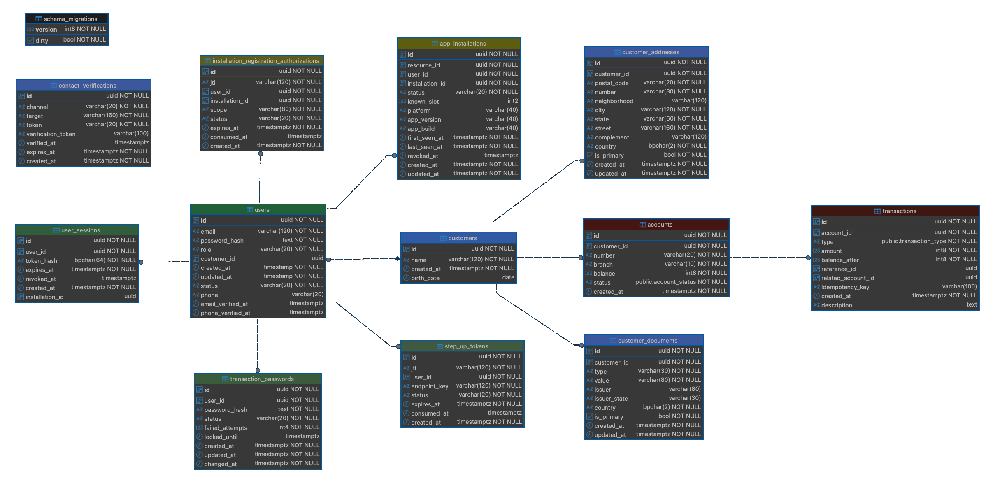

# Documentação do Banco de Dados - Bank API

## 1. Visão Geral

O banco de dados é um **componente de primeira classe** da arquitetura do sistema, ao lado de:

* API (camada de aplicação)
* Cliente mobile (camada consumidora)
* Banco de dados (camada de consistência e persistência)

Ele não é tratado como armazenamento passivo, mas como uma **fronteira ativa de consistência** responsável por:

* garantir integridade dos dados
* sustentar garantias transacionais
* viabilizar operações financeiras determinísticas
* preservar auditabilidade

---

## 2. Princípios de Design

### 2.1 Consistência Forte

Todas as operações que alteram saldo são executadas com garantias de
**consistência forte**, por meio de:

* transações ACID (commit integral ou rollback integral)
* bloqueio em nível de linha (`SELECT ... FOR UPDATE`)
* ordem determinística de atualização para evitar interações concorrentes não determinísticas

Em outras palavras, o sistema não adota **consistência eventual** para fluxo
financeiro: o estado retornado após uma operação commitada já reflete a verdade
persistida no ledger e no snapshot associado.

---

### 2.2 Modelo Baseado em Ledger

O sistema adota um **modelo ledger + estado materializado**:

* `transactions` -> ledger imutável (fonte primária da verdade)
* `accounts.balance` -> estado atual materializado (derivado do ledger)

O ledger é autoritativo para auditoria e reconciliação. O estado materializado
existe para reduzir custo de leitura e latência nas consultas operacionais.

---

### 2.3 Imutabilidade

Registros financeiros são **append-only**:

* sem UPDATE
* sem DELETE

Essa regra é aplicada por trigger no banco de dados.

---

### 2.4 Idempotência no Nível de Dados

A idempotência é implementada diretamente no ledger:

* escopada por conta
* aplicada por índice único
* garante retentativas seguras

---

### 2.5 Redundância Mínima

Cada conceito é representado uma única vez:

* sem ledgers duplicados
* sem tabelas paralelas de transações

---

## 3. Visão Geral do Schema

### Tabelas Centrais

* `customers`
* `customer_documents`
* `customer_addresses`
* `users`
* `user_sessions`
* `contact_verifications`
* `accounts`
* `transactions`

### Tabelas de Suporte

* `schema_migrations`
* `transaction_passwords`
* `step_up_tokens`
* `app_installations`
* `installation_registration_authorizations`

---

## 4. Grupos de Tabelas

O schema fica mais fácil de entender em quatro grupos:

* identidade do cliente e onboarding
* autenticação e estado de sessão
* contas financeiras e ledger
* identidade de instalação e autorizações temporárias



`app_installations` armazena a associação durável da instalação.  
`installation_registration_authorizations` armazena apenas a autorização de curta duração usada enquanto uma nova instalação está sendo certificada.

Essa divisão também reflete as fronteiras de responsabilidade da aplicação:

* tabelas de cliente descrevem a pessoa ou entidade atendida pelo banco
* tabelas de autenticação descrevem quem pode acessar o sistema e sob quais credenciais
* tabelas financeiras registram estado operacional e fatos contábeis
* tabelas de instalação guardam contexto de confiança do canal mobile

O banco evita misturar esses papéis. Um `customer` pode existir antes de ter
conta financeira. Um `user` pode existir em estado pendente antes de acessar o
produto. Uma instalação pode existir como sinal de contexto sem ser uma prova
forte de dispositivo. Essa separação reduz acoplamento e deixa as regras de
cada domínio mais explícitas.

### 4.1 schema_migrations

`schema_migrations` é a tabela operacional usada pela ferramenta de migração
para registrar quais versões de schema já foram aplicadas.

Ela não participa de fluxos de negócio, mas é essencial para governar evolução
do banco:

* evita reaplicar migrations já executadas
* permite identificar a versão estrutural do ambiente
* apoia rollback controlado quando há migrations `down`
* diferencia estado do schema de estado dos dados de negócio

Por ser uma tabela de infraestrutura, ela não aparece nas relações de domínio,
mas deve ser preservada em qualquer ambiente persistente.

---

## 5. Tabelas de Cliente e Onboarding

### 5.1 customers

Representa a entidade de negócio, ou seja, o titular da conta.

Esta tabela não representa credencial de acesso, sessão, conta bancária nem
documento cadastral específico. Ela é o ponto estável que identifica o cliente
como sujeito do relacionamento bancário. A conta financeira referencia
`customers`; a identidade de login fica em `users`; documentos oficiais ficam
em `customer_documents`.

Campos:

* `id` (UUID, PK)
* `name`: nome civil ou nome de cadastro usado no onboarding
* `birth_date`: data de nascimento usada por regras cadastrais e futuras validações KYC
* `created_at`: data de criação do registro

Restrições:

* não há coluna direta de CPF nesta tabela
* contas referenciam `customers(id)` com `ON DELETE RESTRICT`, impedindo remoção de cliente com conta associada

Notas:

* CPF e outros documentos são armazenados em `customer_documents`
* identidade de e-mail e telefone é armazenada em `users`
* a remoção do CPF direto de `customers` permite suportar mais tipos de documento sem alterar o contrato central da entidade
* a tabela é pequena de propósito; atributos voláteis ou multivalorados devem ficar em tabelas próprias

---

### 5.2 customer_documents

Representa documentos de identidade do cliente.

Esta tabela modela documentos como dados cadastrais independentes do usuário de
login. No estado atual, o documento mais importante é o CPF, mas o desenho já
permite expansão para outros documentos e países sem adicionar novas colunas em
`customers`.

Campos:

* `id` (UUID, PK)
* `customer_id` (FK -> customers)
* `type`: tipo do documento, por exemplo `cpf`
* `value`: valor normalizado do documento
* `issuer`: emissor do documento, quando aplicável
* `issuer_state`: unidade federativa ou estado emissor, quando aplicável
* `country`: país do documento, com padrão `BR`
* `is_primary`: indica o documento principal do cliente
* `created_at`
* `updated_at`

Restrições:

* documento único por `(type, value, country)`
* um documento primário por cliente
* documentos são removidos em cascata quando o cliente é removido

Notas:

* a unicidade por documento impede que o mesmo CPF seja usado por dois clientes
* o índice parcial de documento primário evita ambiguidade nos fluxos que precisam escolher um documento representativo
* o cadastro atual usa esta tabela para separar identidade legal da identidade de autenticação

---

### 5.3 customer_addresses

Representa endereços postais do cliente.

Endereço é tratado como dado cadastral do cliente, não da conta. Isso permite
evoluir para múltiplas contas por cliente, histórico de endereço ou políticas
de correspondência sem duplicar dados em `accounts`.

Campos:

* `id` (UUID, PK)
* `customer_id` (FK -> customers)
* `postal_code`: CEP ou código postal
* `number`: número do endereço
* `neighborhood`: bairro
* `city`: cidade
* `state`: estado ou unidade federativa
* `street`: logradouro
* `complement`: complemento opcional
* `country`: país, com padrão `BR`
* `is_primary`: indica o endereço principal
* `created_at`
* `updated_at`

Restrições:

* um endereço primário por cliente
* endereços são removidos em cascata quando o cliente é removido

Notas:

* o endereço ainda não é o centro de nenhum fluxo financeiro crítico, mas prepara o cadastro para KYC e enriquecimento de perfil
* a restrição de endereço primário deixa o modelo pronto para múltiplos endereços sem criar ambiguidade operacional

---

### 5.4 contact_verifications

Representa verificações temporárias de onboarding para e-mail e telefone.

Esta tabela sustenta a prova de posse de contato antes do cadastro definitivo.
Ela separa o momento de pedir/verificar um código do momento de criar o usuário.
O cadastro só aceita e-mail e telefone que tenham gerado `verification_token`
válido.

Campos:

* `id` (UUID, PK)
* `channel` (`email` ou `phone`)
* `target`: e-mail ou telefone normalizado
* `token`: código curto enviado ao usuário
* `verification_token`: token retornado após confirmação e usado pelo cadastro
* `verified_at`: momento da confirmação
* `expires_at`: validade do código ou da tentativa
* `created_at`

Notas:

* o fluxo de cadastro exige tokens de verificação confirmados para e-mail e telefone
* esses tokens são consumidos por `POST /auth/register`
* `(target, channel)` é único; uma nova solicitação substitui a tentativa anterior para o mesmo contato
* `verification_token` é único quando presente
* registros expirados e não verificados são removidos após 24 horas
* registros verificados são mantidos por 7 dias e depois removidos
* a limpeza é executada diariamente pelo `pg_cron` por meio de `cleanup_contact_verifications()`
* esta tabela não é uma fonte permanente de contatos; após o cadastro, e-mail e telefone ficam em `users`

---

## 6. Tabelas de Autenticação e Sessão

### 6.1 users

Representa a identidade de autenticação no sistema.

`users` é a tabela que responde à pergunta "quem está tentando acessar o
sistema?". Ela não é necessariamente a mesma coisa que `customers`: usuários
com papel `customer` devem apontar para um cliente, enquanto usuários `admin`
podem existir sem `customer_id`, pois operam como identidade administrativa.

Campos:

* `id` (UUID, PK)
* `email` (único)
* `phone` (único)
* `password_hash`
* `role`
* `customer_id` (nullable)
* `status`
* `email_verified_at`
* `phone_verified_at`
* `created_at`
* `updated_at`

Restrições:

* `customer_id` deve existir quando `role = customer`
* `customer_id` é único, criando relação 1:1 entre usuário customer e cliente
* `email` e `phone` são únicos para evitar identidade de login duplicada
* `role` deve representar um papel conhecido pela aplicação, como `customer` ou `admin`

Notas:

* `status` é o **estado de ciclo de vida do usuário**
* controla a progressão de onboarding e a elegibilidade para fluxos dependentes de aprovação, como abertura de conta
* usuários `admin` podem ter `customer_id = null`; usuários `customer` devem ter um cliente
* `password_hash` nunca armazena a senha em claro
* `email_verified_at` e `phone_verified_at` registram que o contato foi confirmado antes do cadastro ou login operacional
* a aprovação administrativa altera o usuário de um estado pendente para um estado apto a operar
* o login consulta esta tabela antes de emitir tokens e antes de avaliar conta, instalação e sessão

Estados relevantes (**status**):

* `pending`: usuário cadastrado, mas ainda não aprovado para uso operacional completo
* `active`: usuário apto a autenticar e acessar os fluxos permitidos pelo papel
* `blocked`: usuário impedido de operar, mesmo que as credenciais estejam corretas

---

### 6.2 user_sessions

Representa sessões de autenticação (refresh tokens).

Esta tabela é a âncora server-side dos refresh tokens. O access token é curto e
autocontido; o refresh token precisa continuar verificável e revogável pelo
servidor. Por isso o banco guarda apenas `token_hash`, não o token em texto
claro.

Campos:

* `id` (UUID, PK)
* `user_id` (FK -> users)
* `token_hash` (único)
* `expires_at`
* `revoked_at`
* `installation_id` (UUID nullable)
* `created_at`

Notas:

* `installation_id` vincula refresh sessions a associação de instalação apresentada no login ou no registro.
* Revogar uma instalação invalida as refresh sessions não revogadas para o mesmo usuário e instalação.
* O access token continua tendo vida curta; a refresh session é a fronteira server-side de revogação.
* `revoked_at` permite invalidação sem remover histórico imediato de sessão
* `expires_at` limita a janela máxima de renovação, mesmo que o token nunca seja revogado
* cada refresh token gera um hash único, impedindo reutilização de um mesmo token como sessão distinta
* a rotação de refresh token cria uma nova linha e revoga ou invalida a sessão anterior conforme a regra da aplicação

Relações importantes:

* `user_id` liga a sessão à identidade autenticada
* `installation_id`, quando presente, deve corresponder ao `X-Installation-Id` usado no login e carregado no access token
* sessões sem instalação são toleradas pelo schema, mas o contrato atual de login operacional tende a associar sessões a uma instalação

---

### 6.3 transaction_passwords

Representa a credencial de senha transacional do usuário.

A senha transacional é uma segunda credencial, separada da senha de login, usada
para autorizar operações sensíveis via step-up. Ela reduz o impacto de uma
sessão autenticada comprometida, porque certas ações continuam exigindo uma
prova adicional.

Campos:

* `id` (UUID, PK)
* `user_id` (FK -> users, único)
* `password_hash`
* `status` (`active` ou `blocked`)
* `failed_attempts`
* `locked_until`
* `created_at`
* `updated_at`
* `changed_at`

Notas:

* a senha transacional é separada da senha de login
* `locked_until` é obrigatório enquanto a credencial está bloqueada
* existe um registro de senha transacional por usuário
* `failed_attempts` permite aplicar política progressiva de bloqueio
* `changed_at` separa a data de alteração da credencial de `updated_at`, que pode mudar por bloqueio ou contador
* `password_hash` armazena hash protegido por pepper configurado fora do banco
* a credencial é verificada antes da emissão de `step_up_tokens`

Invariantes:

* um usuário não pode ter duas senhas transacionais ativas em registros diferentes
* status `blocked` exige `locked_until`
* falhas de validação não devem expor se a senha existe ou qual parte da credencial falhou

---

### 6.4 step_up_tokens

Representa autorizações step-up de curta duração e uso único.

`step_up_tokens` registra a autorização temporária emitida depois que o usuário
confirma a senha transacional. O token é escopado por operação pública
(`endpoint_key`) e precisa ser consumido pela ação sensível correspondente,
como transferência interna ou certificação de nova instalação.

Campos:

* `id` (UUID, PK)
* `jti` (identificador JWT único)
* `user_id` (FK -> users)
* `endpoint_key`
* `status` (`active` ou `consumed`)
* `expires_at`
* `consumed_at`
* `created_at`

Notas:

* tokens ativos são rejeitados após `expires_at`
* a validação bem-sucedida altera atomicamente o token para `consumed`
* tokens ativos expirados há mais de 24 horas são removidos
* tokens consumidos são mantidos por 24 horas após `consumed_at`
* a limpeza é executada diariamente às 03:15 pelo `pg_cron` por meio de `cleanup_step_up_tokens()`
* `jti` impede replay do mesmo JWT
* `endpoint_key` vincula a autorização a uma operação específica, evitando que um step-up autorizado para uma ação seja reutilizado em outra
* a transição para `consumed` deve ocorrer na mesma operação lógica que aceita o step-up

Ciclo de vida:

* `active`: token emitido, ainda dentro da validade e ainda não usado
* `consumed`: token usado com sucesso e indisponível para novo uso
* expirado: permanece como `active` até a limpeza, mas é rejeitado pela validação

---

## 7. Tabelas Financeiras

### 7.1 accounts

Representa uma conta financeira.

`accounts` é a visão operacional da conta: guarda o identificador bancário
(`branch`, `number`), o saldo materializado e o estado que determina se a conta
pode participar de operações financeiras. Ela não é a fonte histórica dos
movimentos; esse papel pertence a `transactions`.

Campos:

* `id` (UUID, PK)
* `customer_id` (FK -> customers)
* `number`: número da conta
* `branch`: agência
* `balance` (BIGINT, centavos)
* `status` (enum: active, inactive, blocked)
* `created_at`

Restrições:

* `(branch, number)` é único
* `customer_id` referencia `customers(id)` com deleção restrita
* `balance` deve ser interpretado em centavos, evitando ponto flutuante

Notas:

* `balance` é um snapshot derivado
* deve ser modificado apenas por operações transacionais
* `status` é o **estado operacional da conta**, usado pelas regras do domínio de contas para permitir ou negar operações financeiras
* leituras de saldo podem usar `accounts.balance` por desempenho
* auditoria e reconstrução devem usar `transactions`
* criação de conta é um fluxo administrativo/provisionado, não autosserviço direto do cliente
* uma conta bloqueada ou inativa pode continuar existindo para histórico, mas deve ser recusada por regras de operação financeira

Estados:

* `active`: conta apta a operar
* `inactive`: conta existente, mas fora de uso operacional
* `blocked`: conta impedida de movimentar por regra administrativa ou de risco

---

### 7.2 transactions

Representa o **ledger financeiro**.

Esta é a tabela mais crítica do sistema.

Cada linha registra um fato financeiro já ocorrido. A tabela é desenhada para
ser imutável, auditável e suficiente para reconstruir o efeito de uma operação.
Mesmo quando `accounts.balance` é usado para leitura rápida, `transactions`
continua sendo a trilha histórica e a fonte de reconciliação.

Campos:

* `id` (UUID, PK)
* `account_id` (FK -> accounts)
* `type` (enum: deposit, withdraw, transfer_in, transfer_out)
* `amount` (BIGINT, centavos)
* `balance_after` (BIGINT)
* `reference_id` (UUID, agrupa lançamentos relacionados)
* `related_account_id` (UUID, usado em transferências)
* `description`
* `idempotency_key` (opcional)
* `created_at`

Restrições e índices:

* entradas são protegidas contra UPDATE e DELETE por trigger
* `(account_id, idempotency_key)` é único quando `idempotency_key` não é nulo
* `(reference_id, type)` é único para `transfer_in` e `transfer_out`
* índices por `account_id`, `created_at` e `reference_id` sustentam extrato, recibo e reconstrução de transferência

Notas:

* lançamentos financeiros são append-only
* lançamentos de transferência são pareados por `reference_id`
* idempotência é escopada por `(account_id, idempotency_key)`
* `balance_after` armazena o saldo da conta imediatamente após aquele lançamento
* `related_account_id` permite navegar para a outra ponta de uma transferência sem inferência textual
* `description` guarda a descrição operacional apresentada ao usuário ou ao recibo
* depósitos e saques são modelados como lançamentos simples; transferências internas são modeladas como par de lançamentos

Tipos:

* `deposit`: entrada de valor em uma conta
* `withdraw`: saída de valor de uma conta
* `transfer_out`: saída da conta de origem em uma transferência
* `transfer_in`: entrada na conta de destino em uma transferência

Por que `balance_after` existe:

* facilita extratos sem recalcular todo o histórico
* permite replay determinístico de operações idempotentes
* registra o efeito materializado da operação no momento do commit

---

## 8. Tabelas de Identidade de Instalação

### 8.1 app_installations

Representa associações de instalação de app para um usuário.

Esta tabela registra quais `X-Installation-Id` já foram associados a um usuário.
Ela não identifica um dispositivo com força criptográfica; registra um
identificador gerado pelo cliente e usado como sinal de contexto para login,
sessão e revogação. O objetivo do MVP é controlar instalações conhecidas e
limitar a expansão descontrolada de sessões por usuário.

Campos:

* `id` (UUID, PK)
* `resource_id` (identificador público de gerenciamento)
* `user_id` (FK -> users)
* `installation_id` (UUID v4 gerado pelo cliente)
* `status` (`known` ou `revoked`)
* `known_slot` (1 a 3 enquanto `known`; nulo quando `revoked`)
* `platform` (nullable)
* `app_version` (nullable)
* `app_build` (nullable)
* `first_seen_at`
* `last_seen_at`
* `revoked_at`
* `created_at`
* `updated_at`

Restrições:

* `(user_id, installation_id)` é único
* `(user_id, known_slot)` é único enquanto `status = known`
* `known_slot` deve estar entre 1 e 3 para instalações conhecidas
* `known_slot` deve ser nulo para instalações revogadas
* `revoked_at` deve existir quando `status = revoked` e deve ser nulo quando `status = known`
* `resource_id` é único e usado como identificador público de gerenciamento

Notas:

* `installation_id` é um sinal contextual fraco, não uma prova de posse física do dispositivo.
* Operações públicas de gerenciamento usam `resource_id`; respostas da API não expõem o `installation_id` bruto fornecido pelo cliente.
* Instalações revogadas são mantidas como histórico. Elas não ocupam um slot conhecido, mas continuam provando que o usuário já teve uma primeira instalação e não deve recuperar elegibilidade de bootstrap.
* O MVP intencionalmente não persiste geolocalização, dados biométricos, dados de atestação, fingerprints de dispositivo, histórico de IP, histórico de user agent ou outros atributos de ambiente além das colunas opcionais de metadados do app acima.
* `first_seen_at` marca a primeira associação daquela instalação
* `last_seen_at` permite evoluir para telas de gerenciamento e sinais de atividade
* `platform`, `app_version` e `app_build` são metadados opcionais do app, não critérios fortes de segurança

Papel nos fluxos:

* no primeiro login de um usuário sem qualquer instalação anterior, a linha pode ser criada diretamente por bootstrap
* em logins posteriores com instalação já conhecida, a linha permite emitir sessão operacional
* em logins com instalação nova, a existência de linhas anteriores força fluxo restrito de certificação
* ao revogar uma instalação, refresh sessions daquela instalação são invalidadas

---

### 8.2 installation_registration_authorizations

Representa autorizações restritas de login, de curta duração, para registrar uma nova instalação após autenticação por credenciais.

Esta tabela existe para guardar estado server-side do fluxo intermediário entre
"credenciais corretas" e "nova instalação autorizada". Sem ela, um restricted
access token poderia ser aceito apenas pela assinatura JWT, sem controle
robusto de consumo, expiração server-side e revogação.

Campos:

* `id` (UUID, PK)
* `jti` (identificador JWT único)
* `user_id` (FK -> users)
* `installation_id` (UUID v4 gerado pelo cliente)
* `scope` (`installation.register`)
* `status` (`active`, `consumed` ou `revoked`)
* `expires_at`
* `consumed_at`
* `created_at`

Restrições:

* `jti` é único
* `scope` deve ser `installation.register`
* `status` deve ser `active`, `consumed` ou `revoked`
* `expires_at` deve ser posterior a `created_at`
* uma autorização `consumed` deve ter `consumed_at`
* uma autorização `active` não pode ter `consumed_at`
* só pode existir uma autorização ativa para o mesmo `(user_id, installation_id, scope)`

Notas:

* O restricted access token é retornado apenas ao cliente; o banco mantém o `jti` e os metadados da autorização necessários para validação de uso único.
* Autorizações ativas expiram após cinco minutos.
* Autorizações ativas expiradas há mais de 24 horas são removidas.
* Autorizações consumidas são mantidas por 24 horas após `consumed_at`.
* Autorizações revogadas são mantidas por 24 horas após `created_at`.
* A limpeza é executada diariamente às 03:30 pelo `pg_cron` por meio de `cleanup_installation_registration_authorizations()`.
* ao emitir nova autorização para a mesma instalação, autorizações ativas anteriores são revogadas
* o consumo é feito por `jti`, ligando a linha persistida ao JWT restrito apresentado pelo cliente
* o registro da instalação só prossegue quando a autorização consumida bate com usuário, instalação e escopo esperados

Ciclo de vida:

* `active`: autorização emitida, ainda válida e não usada
* `consumed`: autorização usada com sucesso para registrar a instalação
* `revoked`: autorização invalidada antes do uso, normalmente por emissão de uma nova autorização concorrente

### 8.3 Fluxo de Registro de Instalação

Primeira instalação conhecida:

* login com credenciais e um `X-Installation-Id` válido
* se o usuário não tiver associação de instalação anterior, a instalação é registrada diretamente em `app_installations` pelo bootstrap inicial
* um access token operacional e uma refresh session são emitidos com esse `installation_id`

Nova instalação após a primeira:

* login com credenciais e um novo `X-Installation-Id`
* o backend cria uma linha ativa em `installation_registration_authorizations`
* o backend retorna um restricted access token com escopo `installation.register`
* o cliente conclui a autorização step-up e chama o endpoint de registro de instalação
* a autorização é consumida, a instalação é inserida em `app_installations` e uma sessão operacional é emitida

Instalação revogada:

* permanece em `app_installations` como histórico
* não ocupa um slot conhecido
* impede que o usuário recupere elegibilidade de bootstrap da primeira instalação

Limite de instalações:

* o domínio permite no máximo três instalações conhecidas por usuário
* o limite é aplicado por `known_slot`, reservado transacionalmente
* instalações revogadas liberam o slot, mas continuam registradas como histórico
* quando o limite é atingido, uma nova instalação não recebe autorização restrita e o login retorna erro de limite

---

## 9. Semântica do Ledger

### 9.1 Fonte da Verdade

Todas as alterações de saldo são registradas aqui.

Nenhuma alteração de saldo existe sem um lançamento correspondente no ledger.

Isso significa que `accounts.balance` nunca deve ser interpretado como fato
histórico isolado. Ele é apenas a posição atual materializada. Para explicar
"como este saldo foi formado", o sistema deve consultar `transactions`.

Na prática:

* toda operação que altera saldo cria ao menos um lançamento
* o lançamento registra o saldo posterior em `balance_after`
* a resposta de recibo e o replay idempotente dependem do ledger, não de uma nova simulação da operação

---

### 9.2 Modelo de Transferência

Uma transferência é representada por **dois lançamentos**:

* `transfer_out` (conta de origem)
* `transfer_in` (conta de destino)

Ambos compartilham:

* o mesmo `reference_id`

E contêm:

* `related_account_id` apontando para o outro lado

Essa modelagem evita uma linha ambígua que tenta representar dois efeitos de
saldo ao mesmo tempo. Cada conta recebe seu próprio fato financeiro, com seu
próprio `balance_after`. O vínculo entre os dois fatos é o `reference_id`.

Consequências:

* o extrato de cada conta pode ser lido de forma independente
* o recibo da transferência pode reunir as duas pontas pelo `reference_id`
* a unicidade de `(reference_id, type)` impede duplicar a entrada ou saída do mesmo par

---

### 9.3 Relação com Snapshot

```text
accounts.balance = last(transactions.balance_after)
```

Essa relação é uma invariante de intenção do sistema. O banco não recalcula
automaticamente o saldo a partir do ledger em cada leitura; a aplicação atualiza
o snapshot dentro da mesma transação que insere o lançamento.

O benefício é desempenho previsível em consultas de saldo. O custo é disciplina:
nenhum fluxo deve alterar `accounts.balance` sem inserir o lançamento
correspondente em `transactions`.

---

### 9.4 Aplicação da Imutabilidade

Uma trigger impede:

* UPDATE
* DELETE

Garantindo auditabilidade completa.

A imutabilidade protege contra correções destrutivas. Se uma operação financeira
precisar ser desfeita no futuro, a correção deve ser representada por novos
lançamentos compensatórios, não por alteração do histórico.

---

## 10. Modelo de Idempotência

### 10.1 Escopo

Idempotência é definida como:

```text
(account_id, idempotency_key)
```

O escopo por conta permite que a mesma chave externa seja usada por clientes ou
operações diferentes sem colisão global, desde que não tente repetir a mesma
operação para a mesma conta.

---

### 10.2 Aplicação

Implementada por índice único parcial:

* aplica-se apenas quando `idempotency_key IS NOT NULL`

Operações sem chave de idempotência continuam possíveis, mas não recebem a
mesma proteção de replay seguro. Para operações expostas a retentativa de rede,
o cliente deve enviar chave estável.

---

### 10.3 Comportamento

* primeira execução -> sucesso
* retentativa -> conflito -> replay do resultado

---

### 10.4 Estratégia de Replay

O replay NÃO lê o estado atual.

Em vez disso, reconstrói o resultado usando o ledger:

* localiza `transfer_out` por `(account_id, idempotency_key)`
* usa `reference_id` para encontrar o `transfer_in` correspondente
* retorna os valores armazenados de `balance_after`

Isso garante respostas determinísticas.

Esse ponto é essencial: se o replay lesse `accounts.balance`, poderia retornar
um saldo posterior a outras operações já commitadas. Ao reconstruir pelo ledger,
o sistema devolve o resultado da operação original.

---

## 11. Estratégia de Índices

### Índices de desempenho:

* `(account_id, created_at DESC)` -> consultas de extrato
* `(reference_id)` -> agrupamento de transferências
* `(reference_id, type)` -> pareamento de transferências

### Índice de integridade do par de transferência:

* UNIQUE `(reference_id, type)` para `type IN ('transfer_in', 'transfer_out')` e `reference_id IS NOT NULL`

### Índice de idempotência:

* `(account_id, idempotency_key)` (único parcial)

### Índices de instalação:

* `(user_id, installation_id)` único para identidade durável de instalação
* `(user_id, known_slot)` único quando status é `known`, garantindo no máximo três instalações conhecidas por usuário
* `jti` único para autorizações restritas de instalação
* `(user_id, installation_id, scope)` é único para autorizações restritas de instalação ativas

Os índices não servem apenas a desempenho. Alguns deles codificam regras de
domínio:

* unicidade de documento impede cadastro duplicado da mesma identidade civil
* unicidade de sessão por `token_hash` impede duplicidade de refresh token
* unicidade de `jti` impede replay de JWTs persistidos
* unicidade parcial de idempotência transforma retentativas em conflitos detectáveis
* unicidade de slot conhecido limita instalações sem depender só de checagem em memória

---

## 12. Garantias de Consistência

O sistema garante:

### Atomicidade

* todas as operações sucedem ou falham integralmente

Exemplo: em uma transferência interna, débito, crédito, lançamentos de ledger e
atualização dos dois snapshots devem ser commitados juntos. Se qualquer etapa
falhar, nenhuma delas deve permanecer.

### Consistência

* regras de domínio são sempre aplicadas

As constraints do banco complementam as validações da aplicação. Mesmo que um
bug tente gravar estado inválido, restrições como unicidade, status permitido e
consistência de `revoked_at` reduzem a chance de persistir dados incoerentes.

### Isolamento

* operações concorrentes não corrompem saldo

Bloqueios de linha impedem que duas operações calculem o próximo saldo a partir
do mesmo valor antigo.

### Durabilidade

* operações commitadas são permanentes

Depois do commit, o ledger passa a ser parte da trilha histórica do sistema.

---

## 13. Estratégia de Concorrência

* `SELECT ... FOR UPDATE` usado para bloqueio de contas
* ordem determinística de locks previne deadlocks
* atualizações de saldo são atômicas

Operações que envolvem mais de uma conta devem bloquear as contas em ordem
determinística. Isso evita que duas transferências concorrentes bloqueiem os
mesmos recursos em ordem oposta e criem deadlock evitável.

Além disso, a reserva de `known_slot` em instalações precisa ser transacional:
duas certificações simultâneas não podem ocupar o mesmo slot nem ultrapassar o
limite de três instalações conhecidas.

---

## 14. Invariantes

O banco de dados aplica ou sustenta:

* sem saldo negativo sem regra explícita
* sem operações idempotentes duplicadas
* sem transferências parciais
* sem mutação de dados históricos
* no máximo três instalações conhecidas por usuário
* no máximo uma autorização ativa de registro de instalação para o mesmo usuário, instalação e escopo

Outras invariantes importantes:

* usuário `customer` sempre referencia um `customer`
* usuário `admin` pode existir sem `customer_id`
* refresh sessions revogadas não devem ser aceitas para renovação
* step-up token consumido não deve ser reutilizado
* instalação revogada não deve gerar sessão operacional
* `resource_id` deve ser usado para gerenciamento público de instalação, evitando exposição do `installation_id`

---

## 15. Limitações Conhecidas

* sem constraint FK em `reference_id`
* sem abstração explícita de contabilidade de partidas dobradas
* sem suporte a múltiplas moedas
* sem particionamento do ledger ainda
* identidade de instalação é um sinal contextual do app, não uma atestação de hardware

Essas limitações são escolhas aceitáveis para o estágio atual do projeto, mas
devem ser revisitadas conforme o BankLab ganhar escala ou canais adicionais.
Por exemplo, um painel administrativo real pode exigir modelo próprio de
workstation confiável, MFA administrativo e trilha de auditoria de ações de
backoffice.

---

## 16. Caminho de Evolução

Melhorias futuras podem incluir:

* modelo explícito de débito/crédito
* ledger particionado
* hash de auditoria / integridade criptográfica
* confiança de dispositivo mais forte ou identidade de workstation administrativa

Possíveis evoluções por área:

* financeiro: razão de partidas dobradas explícito, contas contábeis internas e eventos de compensação
* segurança: atestação de dispositivo, MFA administrativo e políticas de risco por instalação
* auditoria: hash encadeado do ledger, trilhas administrativas e relatórios de reconciliação
* dados cadastrais: versionamento de endereço/documento e retenção histórica orientada a compliance

---

## 17. Resumo

O banco de dados atua como:

* o **motor de consistência**
* a **fonte de auditoria**
* a **camada da verdade financeira**

Ele é intencionalmente simples na estrutura, mas estrito no comportamento.

O sistema prioriza:

* correção sobre complexidade
* determinismo sobre flexibilidade
* segurança sobre otimização prematura

Isso o torna uma base sólida para aplicações financeiras.
