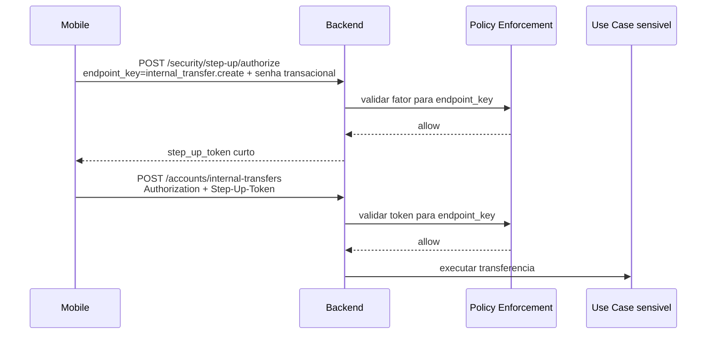
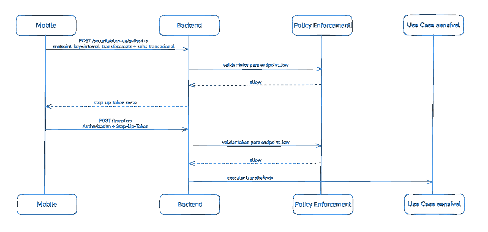

# ZTA MVP: senha transacional e step-up token

## Visão geral

Esta implementação introduz o primeiro incremento de Zero Trust Architecture
(ZTA) no BankLab.

O objetivo não é implementar um motor completo de risco, dispositivo confiável
ou prova de vida. O primeiro passo é criar uma autorização adicional para
operações sensíveis usando senha transacional e um token curto de step-up.

O modelo atual da API já autentica o usuário com JWT e aplica regras de
autorização por papel, propriedade e estado. O novo fluxo adiciona uma pergunta
antes da execução de operações críticas:

```text
Este usuário autenticado acabou de confirmar sua intenção para este endpoint
sensível?
```

## Decisão principal

A senha transacional não será enviada diretamente no endpoint sensível.

Em vez disso, o mobile solicita uma autorização de step-up em um endpoint
próprio. Se a senha transacional for válida, o backend emite um token curto,
de uso único, vinculado a um endpoint lógico específico.

O endpoint sensível recebe:

- o JWT normal da sessão;
- o step-up token emitido previamente.

## Fluxo de alto nível





## Regras do MVP

### Senha transacional

- Deve ser diferente conceitualmente da senha de login.
- Deve ser armazenada somente como hash.
- Pode trafegar explicitamente apenas no endpoint de step-up, sob HTTPS.
- Não deve trafegar no endpoint sensível final.
- Não deve ser enviada pelo mobile como hash.
- Não deve ser logada.

### Tentativas e bloqueio

- O sistema conta tentativas inválidas consecutivas.
- Após 3 tentativas inválidas, a senha transacional é bloqueada
  temporariamente.
- O bloqueio inicial dura 30 minutos.
- Após validação correta, o contador de falhas é zerado.
- Bloqueios definitivos ou baseados em risco ficam para evolução futura.

### Step-up token

- Deve ser um JWT assinado com `HS256`.
- Deve durar 2 minutos.
- Deve ser de uso único.
- Deve estar associado ao usuário autenticado.
- Deve ser vinculado a um endpoint lógico específico.
- No MVP, não deve ser vinculado ao payload da operação.
- O endpoint sensível deve validar usuário, endpoint lógico, expiração e
  consumo.

Regras de consumo e retry no endpoint sensível (`POST /accounts/internal-transfers`):

- O `jti` deve ser consumido de forma atômica antes da execução do use case de
  transferência.
- Se a transferência falhar depois do enforcement (ex.: saldo insuficiente), o
  step-up token permanece consumido.
- Retry com o mesmo `X-Step-Up-Token` deve retornar
  `STEP_UP_TOKEN_CONSUMED`.
- Mesmo com o mesmo `idempotency_key`, o cliente pode precisar obter novo
  step-up token para nova tentativa.

Cobertura automatizada esperada:

- Verifier JWT valida assinatura, algoritmo, expiração e claims obrigatórios.
- `EnforceStepUpUseCase` cobre sucesso, ausência do header, token inválido,
  token expirado, token consumido, mismatch de usuário, mismatch de endpoint e
  divergência entre JWT e registro persistido.
- Teste integrado cobre signer JWT, verifier JWT, repositório Postgres e
  enforcement consumindo o `jti` persistido uma única vez.

## Endpoint lógico

O token de step-up não autoriza um payload específico. Ele autoriza uma única
chamada a um endpoint lógico sensível.

Exemplos de chaves:

```text
internal_transfer.create
withdraw.create
transaction_password.change
```

Essas chaves são internas ao backend e representam a política de segurança. Elas
podem mapear para rotas HTTP concretas, mas não precisam repetir o path literal.

Essa decisão mantém o MVP simples e evita duplicar detalhes sensíveis da
operação em duas chamadas. A vinculação ao payload ou à intenção detalhada pode
ser considerada futuramente para operações de maior risco.

## Criação da senha transacional

A criação inicial da senha transacional acontece em endpoint próprio.

Fluxo conceitual:

```text
1. Usuário autenticado chama o endpoint de criação.
2. Backend valida o JWT e identifica o usuário.
3. Backend valida o formato da senha transacional.
4. Backend verifica se já existe senha transacional ativa.
5. Backend gera o hash da senha.
6. Backend persiste a credencial.
7. Backend retorna sucesso sem expor senha, hash ou material sensível.
```

Contrato definido:

```http
POST /security/transaction-password
Authorization: Bearer <access_token>
```

```json
{
  "transaction_password": "123456",
  "transaction_password_confirmation": "123456"
}
```

A criação inicial exige JWT válido, mas não exige senha transacional anterior nem
step-up token, pois essa credencial ainda não existe.

## Autorização de step-up

Contrato definido:

```http
POST /security/step-up/authorize
Authorization: Bearer <access_token>
```

```json
{
  "endpoint_key": "internal_transfer.create",
  "transaction_password": "123456"
}
```

Resposta definida, seguindo o envelope de resposta da API:

```json
{
  "data": {
    "step_up_token": "<token>",
    "expires_in": 120
  },
  "error": null
}
```

Uso no endpoint sensível:

```http
POST /accounts/internal-transfers
Authorization: Bearer <access_token>
X-Step-Up-Token: <step_up_token>
```

## Nomes definidos

```text
Endpoint de criação da senha transacional:
POST /security/transaction-password

Endpoint de autorização de step-up:
POST /security/step-up/authorize

Endpoint sensível protegido no primeiro corte:
POST /accounts/internal-transfers

Header do token de step-up:
X-Step-Up-Token

Endpoint lógico:
internal_transfer.create
```

Campos JSON:

```text
endpoint_key
transaction_password
transaction_password_confirmation
step_up_token
expires_in
```

Todas as respostas devem seguir o padrão definido em
`api/docs/05-error_and_response.md`: sucesso com `data` preenchido e
`error: null`; erro com `data: null` e `error.code`, `error.message` e
`error.details` quando houver detalhes estruturados.

Contrato inicial de erros:

| Código                             | HTTP | Cenário                                                |
| ---------------------------------- | ---: | ------------------------------------------------------ |
| `TRANSACTION_PASSWORD_ALREADY_SET` |  409 | usuário tenta criar senha transacional já ativa        |
| `TRANSACTION_PASSWORD_REQUIRED`    |  403 | endpoint sensível exige step-up                        |
| `TRANSACTION_PASSWORD_NOT_SET`     |  409 | usuário ainda não possui senha transacional cadastrada |
| `TRANSACTION_PASSWORD_INVALID`     |  401 | PIN transacional inválido                              |
| `TRANSACTION_PASSWORD_LOCKED`      |  403 | PIN transacional bloqueado temporariamente             |
| `STEP_UP_ENDPOINT_NOT_ALLOWED`     |  403 | endpoint lógico não autorizado para emissão step-up    |
| `STEP_UP_TOKEN_REQUIRED`           |  401 | endpoint sensível foi chamado sem `X-Step-Up-Token`    |
| `STEP_UP_TOKEN_INVALID`            |  401 | token de step-up inválido ou malformado                |
| `STEP_UP_TOKEN_EXPIRED`            |  401 | token de step-up expirado                              |
| `STEP_UP_TOKEN_CONSUMED`           |  401 | token de step-up já utilizado                          |
| `STEP_UP_ENDPOINT_MISMATCH`        |  403 | token válido, mas emitido para outro endpoint lógico   |

## Ponto de entrada arquitetural

O ponto de entrada do ZTA fica entre delivery e application.

```text
Delivery HTTP
  -> Policy Enforcement Point
    -> Policy Engine
      -> Transaction Password Factor
  -> Application Use Case
```

O handler HTTP continua responsável por request/response. O use case sensível
continua responsável pela regra de negócio. A validação de step-up fica fora do
use case sensível, protegendo sua entrada.

## Responsabilidades

### Delivery HTTP

- Autenticar a requisição via middleware existente.
- Parsear request.
- Extrair o usuário autenticado.
- Encaminhar endpoint lógico, credenciais e contexto ao enforcement.
- Responder erros de step-up sem chamar o use case sensível.

### Policy Enforcement Point

- Proteger a entrada de endpoints sensíveis.
- Solicitar decisão de política.
- Permitir ou negar a chamada ao application use case.

### Policy Engine

- Decidir quais fatores são exigidos para cada endpoint lógico.
- Validar se os fatores apresentados satisfazem a política.
- Retornar `allow`, `deny` ou `challenge`.

### Transaction Password Factor

- Buscar a senha transacional do usuário.
- Verificar se a credencial existe e está ativa.
- Comparar senha informada com hash armazenado.
- Incrementar falhas em caso de senha inválida.
- Aplicar bloqueio temporário após 3 falhas.
- Zerar falhas em caso de validação correta.

## Modelo conceitual de dados

### transaction_passwords

```text
transaction_passwords
- id
- user_id
- password_hash
- status
- failed_attempts
- locked_until
- created_at
- updated_at
- changed_at
```

### step_up_tokens

```text
step_up_tokens
- id
- jti
- user_id
- endpoint_key
- status
- expires_at
- consumed_at
- created_at
```

Mesmo que o token seja JWT, o backend precisa rastrear um identificador para
garantir uso único.

## Resultado esperado

Com esse desenho, uma operação sensível deixa de depender apenas de uma sessão
JWT válida. Ela passa a exigir uma confirmação recente de intenção, emitida para
um endpoint lógico específico, com curta duração e consumo único.

Esse MVP cria a base para evoluções futuras com dispositivo confiável, prova de
vida, biometria local, sinais de risco e políticas mais fortes por contexto da
operação.
