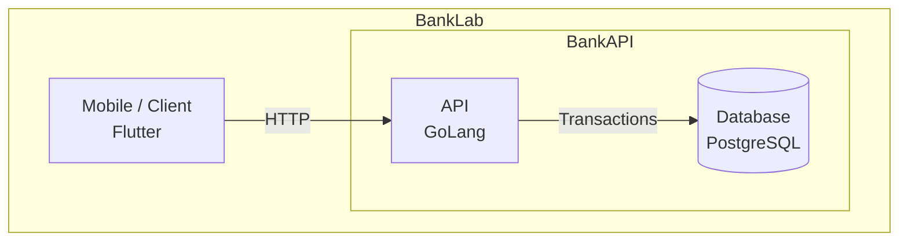
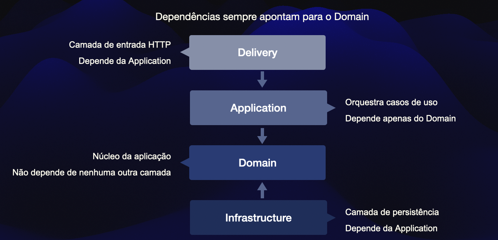

# Apresentacão - BankLab - Bank API

Material de apoio para apresentar a arquitetura, os principais fluxos e as decisões de desenho da API.


# Slide 1

## Projeto Banklab - Bank API

### Aurix - Fevereiro de 2026

- Artigos de ZTA



### Licença MIT

> A escolha da licença MIT reflete a intenção de manter o projeto aberto e acessível, sem impor restrições sobre seu uso futuro.

Por se tratar de uma aplicação com características de fintech, optou-se por uma licença permissiva, permitindo que o código seja estudado, modificado e reutilizado em diferentes contextos — inclusive comerciais — sem a obrigatoriedade de abertura de código derivado, como ocorre em licenças copyleft (ex: GPL).

Essa decisão oferece maior flexibilidade para evolução do projeto, tanto no contexto acadêmico quanto em possíveis aplicações práticas, incluindo a base para novos produtos ou serviços.

Por: Rudson R. Alves
24 de março de 2026

---

# Slide 2: Objetivo da API

## Bank API

API em Go para um core bancário simplificado, com foco em:

- autenticação e sessão (Login e senha, token de acesso e refresh, ZTA, ...)
- cadastro de cliente (Cadastro simples, espandir o onboarding e KYC)
- aprovação administrativa de usuário (Criação de conta bancária, expandir para administração de contas, ...)
- operações financeiras: depósito, saque, transferência, saldo e extrato
  - criação e consulta de contas
  - adicionar suporte a PIX BR e "PIX EU", ...
- consistência transacional em operações de saldo

## Introdução

Embora a Bank API ainda seja uma aplicação pequena, ela não deve ser entendida apenas como um CRUD. 

Em um CRUD simples, a preocupação principal costuma ser criar, consultar, atualizar e remover registros. 

Nesta API, as operações envolvem 
- regras de negócio, 
- controle de acesso, 
- consistência financeira e 
- separação de responsabilidades entre módulos.

---

Entidades como usuário, cliente, conta e transação parecem simples quando observadas isoladamente. 

Porém, o comportamento esperado de um sistema bancário muda a natureza dessas operações. 

Criar uma conta, por exemplo, não significa apenas inserir uma linha na tabela `accounts`. 

Antes disso, a aplicação precisa verificar 

- se o usuário existe, 
- se passou pelo processo de aprovação, 
- se possui um `customer_id` associado e 
- se está autorizado a executar aquele fluxo.

---

**As operações de saldo exigem ainda mais cuidado.** Depósito, saque e transferência não podem ser tratados como atualizações comuns de banco de dados. 

O sistema precisa 

- impedir valores inválidos, 
- evitar saldo negativo, 
- proteger atualizações concorrentes, 
- registrar o histórico da movimentação e 
- garantir que uma falha no meio do processo não deixe dados parcialmente atualizados.

---

A arquitetura também precisa deixar claro qual módulo é responsável por cada decisão. 

A aprovação de usuário é uma operação administrativa, mas isso não torna o módulo `admin` dono das regras de conta. 

- O módulo `admin` coordena o fluxo restrito a administradores; 
- o módulo `account` continua responsável pelas regras de conta; 
- o módulo `customer` representa os dados do cliente; 
- e o módulo `auth` concentra autenticação, sessão e identidade do usuário autenticado.

Por isso, a estrutura da API procura responder perguntas de negócio e não apenas organizar arquivos:

- quem pode acessar determinada operação?
- de onde vem a identidade do usuário?
- quando um usuário pode ter uma conta criada?
- qual módulo é dono de cada regra?
- como evitar inconsistência em operações financeiras?
- como manter o código testável e evolutivo?

O objetivo da apresentação é mostrar como essas decisões aparecem no código. A Bank API usa uma arquitetura em camadas para manter o HTTP na borda, os casos de uso na camada de aplicação, as regras no domínio e os detalhes técnicos na infraestrutura. Essa organização reduz acoplamento e cria uma base mais segura para evoluir o produto.

---

# Slide 3: Estilo arquitetural

## Modular monolith + layered architecture

```text
delivery -> application -> domain
infrastructure -> domain
```

Camadas:

- `delivery`: HTTP, request, response, middleware e status codes
- `application`: casos de uso, orquestracao e transacoes
- `domain`: entidades, invariantes, contratos e erros de negocio
- `infrastructure`: PostgreSQL, pgx, JWT, bcrypt e adaptadores técnicos

## Conteúdo de apoio

A Bank API utiliza uma arquitetura de monolito modular com separação em camadas. 

Isso significa que a aplicação é executada como um único serviço, mas seu código é organizado em módulos de negócio com fronteiras internas claras. 

Essa escolha evita a complexidade operacional de microsserviços no estágio atual do projeto, sem abrir mão de uma estrutura preparada para crescimento.

---

Em uma arquitetura baseada em microsserviços, cada módulo poderia se tornar um serviço independente, com deploy, banco, comunicação e observabilidade próprios.

Essa abordagem pode fazer sentido em sistemas maiores, mas também introduz custos: comunicação distribuída, versionamento entre serviços, latência de rede, consistência eventual, rastreamento distribuído e maior complexidade de operação. Para esta API, esses custos ainda não são necessários.

---

O monolito modular oferece um equilíbrio mais adequado para o momento. 

A aplicação continua simples de executar, testar e implantar, mas o código não fica misturado em uma única camada genérica. 

Módulos como `auth`, `account`, `customer` e `admin` mantêm responsabilidades próprias. 

Dentro deles, as camadas `delivery`, `application`, `domain` e `infrastructure` ajudam a controlar onde cada tipo de decisão deve ficar.

---



A regra de dependência é o ponto mais importante dessa arquitetura:

Essa direção indica que a camada de entrada HTTP pode chamar casos de uso, e os casos de uso podem usar contratos e regras do domínio. 

A infraestrutura também depende do domínio porque implementa contratos definidos por ele, como repositórios. 

O domínio, por outro lado, não depende de HTTP, PostgreSQL, JWT, pgx, bcrypt ou qualquer detalhe técnico externo.

---

Essa separação protege as regras de negócio. 

**Por exemplo:**, uma regra como "uma conta inativa não pode receber depósito" pertence ao domínio ou ao caso de uso, não ao handler HTTP nem à query SQL. 

- O handler deve traduzir requisições e respostas; 
- a infraestrutura deve persistir e recuperar dados; 
- mas a decisão de negócio precisa permanecer independente desses detalhes.

O resultado é uma estrutura mais testável e menos acoplada. 

- Casos de uso podem ser testados sem subir servidor HTTP. 
- Regras de domínio podem ser validadas sem banco de dados. 
- A infraestrutura pode mudar, por exemplo de PostgreSQL para outro mecanismo, sem exigir que o domínio conheça essa troca. 
- Da mesma forma, a API HTTP poderia evoluir sem que as regras centrais precisem ser reescritas.

---

*Portanto, a escolha por monolito modular não significa ausência de arquitetura.*

Pelo contrário: 

- ela mantém a operação simples enquanto organiza o código para que as responsabilidades fiquem explícitas e 
- para que a aplicação possa evoluir de forma incremental.

---

# Slide 4: Mapa de diretórios

```sh
api
├── cmd
│   └── api                 # bootstrap, wiring e rotas
├── docs                    # documentação técnica
├── migrations              # evolução de schema
└── internal
    ├── account             # contas, saldo, transações e extrato
    ├── admin               # operações restritas a administradores
    ├── auth                # registro, login, refresh, usuário atual
    ├── bootstrap           # inicialização
    ├── customer            # dados do cliente
    ├── database            # pool e helpers de transação
    └── shared              # utilitarios compartilhados
```

## Conteúdo de apoio

A estrutura de diretórios da API reflete a organização arquitetural do projeto.

> Em vez de agrupar todos os handlers em uma pasta, todos os repositórios em outra e todos os casos de uso em outra, **a aplicação prioriza uma divisão por módulos de negócio**.

Isso ajuda a localizar as funcionalidades a partir do domínio que elas representam.

---

O diretório `internal` concentra o código privado da API. 

> Em Go, o uso de `internal` impede que outros módulos externos importem esses pacotes diretamente, a nível de compilador. 

Isso reforça a ideia de que essa implementação pertence à própria aplicação e não é uma biblioteca pública.

Dentro de `internal`, os principais módulos de negócio são 

- `account`, 
- `auth`, 
- `customer` e 
- `admin`.

---
O diretório `cmd/api` é o ponto de entrada da aplicação. 

Nele fica a composição principal do serviço: 
- criação das dependências concretas, 
- instanciação dos casos de uso, 
- configuração dos handlers, 
- registro das rotas HTTP e 
- inicialização do servidor.

Ele funciona como o local onde as partes da aplicação são conectadas.

---

O diretório `migrations` registra a evolução do schema do banco de dados. 

Ele é importante porque mudanças estruturais no banco fazem parte da história da aplicação e precisam acompanhar o código versionado.

---

O diretório `docs` contém a documentação técnica da API. 

Ele funciona como um mapa complementar para entender arquitetura, fluxos de caso de uso, contrato REST, banco de dados e decisões de implementação.

---

O módulo `account` concentra funcionalidades relacionadas a contas bancárias. 

Isso inclui 
- criação de conta, 
- listagem de contas, 
- consulta de saldo, 
- depósito, 
- saque, 
- transferência e 
- extrato. 
  
Por lidar com operações financeiras, é o módulo com maior preocupação transacional e regras de consistência.

---

O módulo `admin` reúne operações restritas a usuários administrativos. 

Um exemplo é a aprovação de usuários. 

Mesmo assim, o admin não deve concentrar regras pertencentes a outros módulos. 

Ele pode orquestrar um fluxo restrito, mas regras de conta continuam no módulo `account`, regras de cliente no módulo `customer`, e regras de autenticação no módulo `auth`.

---

O módulo `auth` concentra 

- autenticação, 
- login, 
- registro, 
- refresh token, 
- sessão e 
- identificação do usuário atual. 

Ele é responsável por estabelecer quem é o usuário autenticado e quais dados de identidade estarão disponíveis para as demais operações protegidas.

---

O módulo `customer` representa os dados do cliente associado ao usuário. 

Ele separa informações de cliente da identidade de autenticação. 

Essa distinção é importante porque um usuário é uma credencial de acesso ao sistema, enquanto um customer representa a pessoa ou entidade de negócio atendida pela instituição.

---

Além dos módulos de negócio, existem diretórios de suporte. 

O diretório `database` contém recursos compartilhados de acesso ao banco, como criação do pool e abstrações auxiliares de transação. 

O diretório `shared` contém utilitários realmente transversais, como contexto autenticado compartilhado entre handlers e casos de uso. 

Já `bootstrap` concentra rotinas de inicialização necessárias para preparar o processo.

---

A organização do projeto tenta deixar claro onde procurar cada tipo de responsabilidade.

- Se a mudança envolve autenticação, provavelmente começa em `auth`. 
- Se envolve saldo ou conta, começa em `account`. 
- Se envolve aprovação administrativa, começa em `admin`, mas pode orquestrar regras pertencentes a outros módulos.

Essa organização também ajuda no trabalho com IA e com novos desenvolvedores. 

Quando os limites dos diretórios são claros, fica mais fácil pedir alterações específicas sem que a implementação se espalhe por lugares inadequados. 

O mapa de diretórios, portanto, é também um mapa de responsabilidade.

---

# Slide 5: Anatomia de um módulo

Estrutura esperada:

```sh
internal/<module>/
├── delivery
├── application
├── domain
└── infrastructure
```

Exemplo em `account`:

```sh
internal/account/
├── application
│   ├── account       # create account, list accounts, balance
│   ├── statement     # statement
│   └── transaction   # deposit, withdraw, transfer
├── delivery          # handlers HTTP
├── domain            # Account, Transaction, repositories
└── infrastructure    # PostgreSQL repository
```

## Anatomia de um módulo

Cada módulo da API é organizado internamente em camadas. Essa organização existe para separar responsabilidades e deixar claro onde cada tipo de código pertence. 

A estrutura base é:

```sh
internal/<module>/
├── delivery
├── application
├── domain
└── infrastructure
```

> Essa divisão é usada para evitar que entrada HTTP, regra de negócio, orquestração de caso de uso e acesso ao banco fiquem misturados no mesmo lugar.

---

A camada `delivery` é a camada de entrada da aplicação. 

- Ela recebe requisições HTTP, 
- lê parâmetros de rota, 
- query params e body JSON, 
- extrai dados do contexto autenticado, 
- chama o caso de uso correspondente e 
- transforma o resultado em resposta HTTP.

A responsabilidade da `delivery` é adaptar o protocolo HTTP para a aplicação. 

Ela trata coisas como:

- decodificação de JSON;
- validação de formato de parâmetros;
- extrair os parâmetros do 
  - path 
  - e query;
- extração do usuário autenticado do contexto;
- chamada do caso de uso;
- conversão de erros internos em status codes;
- montagem do envelope de resposta.

> A camada `delivery` não é dona da regra de negócio. 

Ela pode rejeitar uma requisição por problema: 
- de transporte ou formato,
- como JSON inválido,
- UUID malformado ou
- query param inesperado.

Porém, decisões como “usuário pode criar conta”, “conta pode receber depósito”, “saldo é suficiente para saque” ou “transferência entre essas contas é permitida” pertencem às camadas internas.

---

A camada `application` contém os casos de uso. 

Um caso de uso representa uma ação executada pelo sistema, como 

- criar conta, 
- listar contas, 
- consultar saldo, 
- aprovar usuário, 
- depositar, 
- sacar, 
- transferir ou 
- buscar extrato.

A responsabilidade da `application` é coordenar o fluxo da operação. 

Ela recebe 

- uma entrada já adaptada pela camada HTTP, 
- aplica validações de aplicação, 
- consulta contratos de repositório, 
- usa regras do domínio, 
- controla transações quando necessário e 
- retorna um resultado para a camada de entrega.

Exemplos de responsabilidades da `application`:

- validar se o usuário autenticado possui `customer_id`;
- verificar se um usuário está ativo antes de criar uma conta;
- abrir uma transação para aprovar usuário e criar conta atomicamente;
- coordenar débito, crédito e ledger em uma transferência;
- chamar repositórios sem depender da implementação concreta do banco;
- retornar erros de aplicação ou domínio para serem traduzidos pela `delivery`.

---

A camada `domain` contém o núcleo conceitual do módulo. 

Ela define 

- entidades, 
- invariantes, 
- contratos, 
- erros e 
- regras fundamentais do negócio.

No módulo `account`, por exemplo, o domínio contém conceitos como

- conta, 
- transação, 
- status da conta, 
- saldo insuficiente, 
- conta inativa e 
- regras como `CanDeposit`, `CanWithdraw` e `CanTransfer`.

A responsabilidade do `domain` é expressar regras de negócio sem depender de detalhes técnicos. 

O domínio não depende de HTTP, PostgreSQL, JWT, `pgx`, `net/http` ou frameworks. 

Ele representa o que é verdadeiro para o negócio independentemente da forma como a aplicação recebe requisições ou persiste dados.

Exemplos de responsabilidades do `domain`:

- definir o que é uma conta válida;
- impedir saque com valor inválido;
- impedir saque sem saldo suficiente;
- impedir transferência para a mesma conta;
- impedir operações em conta inativa;
- definir contratos como `AccountRepository`;
- declarar erros de negócio como `ErrInsufficientBalance` ou `ErrAccountInactive`.

---

A camada `infrastructure` contém implementações técnicas. 

Ela implementa contratos definidos pelas camadas internas usando tecnologias concretas.

No projeto atual, `infrastructure` contém principalmente repositórios PostgreSQL. 

Essa camada conhece 

- `pgx`, 
- SQL, 
- tabelas, 
- linhas, 
- transações de banco e 
- mapeamento entre registros persistidos e entidades da aplicação.

A responsabilidade da `infrastructure` é fazer a ponte entre os contratos da aplicação/domínio e o mundo externo. 

Ela não define 

- a regra de negócio principal; 
- ela fornece os meios técnicos para executar persistência, consulta e integração.

Exemplos de responsabilidades da `infrastructure`:

- executar queries SQL;
- inserir contas no PostgreSQL;
- consultar contas por `customer_id`;
- bloquear linhas com `SELECT ... FOR UPDATE`;
- atualizar saldo;
- persistir registros no ledger;
- converter erros do banco para erros conhecidos do domínio;
- implementar transações com `pgx`.

---

No módulo `account`, a camada `application` ainda é subdividida por grupos de caso de uso:

```text
internal/account/
├── application
│   ├── account
│   ├── statement
│   └── transaction
```

Essa subdivisão organiza melhor responsabilidades internas do próprio módulo. 

O grupo `account` concentra 

- criação de conta, 
- listagem de contas e 
- consulta de saldo. 

O grupo `transaction` concentra 

- depósito, 
- saque e 
- transferência. 

O grupo `statement` concentra 

- consulta de extrato.

---
---

Um fluxo de depósito por terminal, quando esse canal existir, passará pelas camadas assim:

```text
POST /terminal/accounts/{id}/deposit
  -> account/delivery
  -> account/application/transaction
  -> account/domain
  -> account/infrastructure
```

Nesse fluxo, 
- a `delivery` lê o `account_id` da rota e o `amount` do JSON. 
- A `application` coordena a operação de depósito. 
- O `domain` valida se a conta pode receber depósito. 
- A `infrastructure` carrega a conta, atualiza o saldo e registra a movimentação no banco.

---

Essa separação facilita testes. 

- Regras de domínio podem ser testadas sem HTTP e sem banco de dados. 
- Casos de uso podem ser testados com repositórios falsos ou mocks. 
- Handlers podem ser testados verificando status code e payload. 
- Repositórios podem ser testados separadamente contra PostgreSQL.

A separação também facilita manutenção. 

- Quando uma resposta HTTP muda, a alteração tende a ficar em `delivery`. 
- Quando uma regra de negócio muda, a alteração tende a ficar em `application` ou `domain`. 
- Quando uma query ou índice muda, a alteração tende a ficar em `infrastructure`.

---

> Cada módulo funciona como uma pequena unidade de negócio dentro da aplicação. 
> Ele possui sua entrada, seus casos de uso, suas regras e suas implementações técnicas. 
> Essa anatomia reduz acoplamento e torna mais fácil entender, testar e evoluir a API.

---

# Slide 6: Ciclo de uma requisição

```text
HTTP Request
  -> Delivery handler
  -> Application use case
  -> Domain rules/contracts
  -> Infrastructure repository
  -> Application result
  -> Delivery response
  -> HTTP Response
```

---

**Exemplo**

```http
GET /accounts
```

Fluxo:

```text
account/delivery.ListAccounts
  -> account/application/account.ListAccounts
  -> account/domain.AccountRepository
  -> account/infrastructure.PostgresRepository
```

## Ciclo de uma requisição

O fluxo geral é:

```text
HTTP Request
  -> Delivery handler
  -> Application use case
  -> Domain rules/contracts
  -> Infrastructure repository
  -> Application result
  -> Delivery response
  -> HTTP Response
```

Esse fluxo representa a direção principal da aplicação. 

A requisição 

- entra pela borda HTTP, 
- passa por um caso de uso, 
- utiliza regras e contratos do domínio, 
- acessa recursos técnicos por meio da infraestrutura e 
- retorna para a camada HTTP em formato de resposta.

---

A primeira etapa é o `HTTP Request`. 

É a chamada feita pelo cliente, como 

 -  o mobile app, 
 -  um frontend web, 
 -  uma ferramenta como Bruno ou
 -  outro sistema. 
 
Essa requisição contém método HTTP, path, headers, query params e, quando aplicável, body JSON.

**Exemplo:**

```http
GET /accounts
Authorization: Bearer <access_token>
```

Essa chamada pede à API a lista de contas do usuário autenticado.

A requisição é recebida por um `delivery handler`. 

O handler pertence à camada `delivery`, que é responsável por adaptar HTTP para a aplicação. 

Ele 

- lê dados da requisição, 
- valida aspectos de transporte, 
- extrai o usuário autenticado do contexto e 
- monta a entrada esperada pelo caso de uso.

No caso de `GET /accounts`, o handler verifica 

- se existe usuário autenticado, 
- rejeita query params inesperados e 
- monta uma entrada contendo o usuário atual.  

Ele não decide quais contas o usuário pode acessar por regra própria; ele chama o caso de uso responsável por isso.

---

Depois, a requisição chega ao `application use case`. 

Essa é a camada que representa a ação do sistema. 

No exemplo, o caso de uso é `ListAccounts`. 

Ele 

- recebe o usuário autenticado e 
- executa o fluxo de listagem das contas vinculadas ao `customer_id` daquele usuário.

A camada `application` coordena a operação. 

Ela valida condições de aplicação, como a 

- existência de `customer_id` no usuário autenticado, 
- chama repositórios por meio de contratos e 
- transforma o resultado em uma saída própria do caso de uso.

---

O próximo elemento é o `domain`. 

O domínio fornece 

- regras, 
- entidades, 
- contratos e 
- erros usados pelos casos de uso. 

Nem todo fluxo simples executa um método de entidade complexo, mas mesmo nesses casos ele costuma depender de contratos ou erros definidos no domínio.

No exemplo de listagem de contas, o caso de uso depende do contrato `AccountRepository`, definido no módulo de conta. 

Esse contrato expressa que a aplicação precisa listar contas por `customer_id`, sem dizer como isso será feito tecnicamente.

---

Depois vem a `infrastructure`. 

Essa camada implementa o contrato usando tecnologia concreta. No projeto atual, isso significa principalmente PostgreSQL com `pgx`.

No exemplo de `GET /accounts`, a implementação PostgreSQL executa uma query semelhante a:

```sql
SELECT id, customer_id, number, branch, balance, status, created_at
FROM accounts
WHERE customer_id = $1
ORDER BY created_at ASC, id ASC
```

A infraestrutura 

- consulta o banco, 
- converte as linhas retornadas em objetos da aplicação e 
- devolve o resultado ao caso de uso.

---

Após isso, o resultado volta para a camada `application`. 

O caso de uso recebe a lista de contas retornada pelo repositório e monta uma saída adequada para a operação. 

Se houver erro, ele retorna um erro conhecido para ser tratado pela camada de entrega.

---

A camada `delivery` então transforma esse resultado em resposta HTTP. No caso de sucesso, ela monta o envelope padrão da API:

```json
{
  "data": [
    {
      "id": "fb3a1709-57a9-4c35-ba90-5a5dca6fdb4b",
      "customer_id": "6f3ebf86-bf82-4b75-a2ce-cd261ca47ec3",
      "number": "10000001",
      "branch": "0001",
      "status": "active"
    }
  ],
  "error": null
}
```

Se ocorrer erro, a `delivery` converte o erro interno em status code e payload padronizado. 

Por exemplo, se não houver usuário autenticado, a resposta pode ser `401 UNAUTHORIZED`. 

Se o usuário autenticado não possuir `customer_id`, a resposta pode ser `403 FORBIDDEN`.

A resposta final é o `HTTP Response`, enviado de volta ao cliente.

---

Portanto, a requisição não atravessa o sistema de forma aleatória. Existe um caminho controlado:

```text
HTTP entra pela delivery
caso de uso coordena a operação
domínio fornece regras e contratos
infraestrutura executa detalhes técnicos
delivery traduz o resultado de volta para HTTP
```

Esse fluxo evita que a regra de negócio fique presa ao HTTP ou ao banco de dados. O handler não precisa saber como a query funciona. O repositório não precisa saber qual endpoint chamou a operação. O domínio não precisa saber se a requisição veio de REST, gRPC, fila ou qualquer outra interface.

Essa separação também melhora testabilidade. 

- O handler pode ser testado como adaptação HTTP. 
- O caso de uso pode ser testado com repositórios falsos. 
- O domínio pode ser testado isoladamente. 
- A infraestrutura pode ser testada contra o banco.

No caso concreto de `GET /accounts`, o fluxo pode ser resumido assim:

```text
GET /accounts
  -> account/delivery.ListAccounts
  -> account/application/account.ListAccounts
  -> account/domain.AccountRepository.ListByCustomerID
  -> account/infrastructure.PostgresRepository.ListByCustomerID
  -> response JSON
```

A mensagem essencial é que cada camada tem um papel específico dentro do ciclo da requisição. Essa clareza reduz acoplamento, facilita manutenção e ajuda a localizar onde uma mudança deve ser feita.

---

# Slide 7: Superfície REST

Autenticação:

```text
POST /auth/register
POST /auth/login
POST /auth/refresh
GET  /auth/me
```

Admin:

```text
POST /admin/users/{id}/approve
```

Customer:

```text
GET /customers/me
```

Account:

```text
GET  /accounts
POST /admin/customers/{customer_id}/accounts
GET  /accounts/{id}/balance
POST /accounts/internal-transfers
GET  /accounts/{id}/statement
```

As rotas de depósito e saque por terminal estão previstas, mas não são registradas no roteador HTTP atual.

## Superfície REST

Este slide apresenta os endpoints HTTP expostos pela API. A superfície REST é o contrato externo do backend: é por ela que o mobile app, ferramentas de teste ou outros clientes interagem com o sistema.

A API está organizada em grupos de endpoints por responsabilidade:

```text
auth
admin
customer
account
```

Essa organização reflete os módulos principais da aplicação. Cada grupo representa uma área funcional do sistema.

O grupo `auth` concentra autenticação, sessão e identidade do usuário:

```text
POST /auth/register
POST /auth/login
POST /auth/refresh
GET  /auth/me
```

`POST /auth/register` cria um novo usuário e o customer associado. Este endpoint inicia o relacionamento do usuário com o sistema, mas o usuário ainda pode depender de aprovação para acessar certas funcionalidades.

`POST /auth/login` autentica o usuário e retorna os tokens necessários para acessar rotas protegidas.

`POST /auth/refresh` renova o access token usando refresh token. O fluxo implementa rotação de refresh token, o que permite controle server-side de sessões e reduz risco em caso de token antigo comprometido.

`GET /auth/me` retorna os dados do usuário autenticado atual. Esse endpoint é útil para o cliente confirmar identidade, role e `customer_id` associados ao token.

O grupo `admin` concentra operações restritas a administradores:

```text
POST /admin/users/{id}/approve
POST /admin/customers/{customer_id}/accounts
```

Esse endpoint aprova um usuário pendente. A aprovação altera o status do usuário para `active` e cria uma conta associada de forma atômica. É uma operação administrativa porque exige permissão elevada, mas ela orquestra regras que pertencem também a outros módulos, como `account` e `customer`.

`POST /admin/customers/{customer_id}/accounts` cria contas adicionais para um customer existente. A criação de conta não é self-service do cliente.

O grupo `customer` concentra informações do cliente vinculado ao usuário autenticado:

```text
GET /customers/me
```

Esse endpoint retorna o perfil de customer associado ao usuário logado. A API não exige que o cliente envie `customer_id`; essa informação é derivada do token/contexto autenticado.

O grupo `account` concentra funcionalidades de conta bancária:

```text
GET  /accounts
GET  /accounts/{id}/balance
POST /accounts/internal-transfers
GET  /accounts/{id}/statement
```

As rotas de depósito e saque por terminal não fazem parte da superfície REST ativa enquanto não existir um canal de terminal real.

`GET /accounts` lista as contas do usuário autenticado. Ele usa o `customer_id` presente no contexto autenticado e não aceita filtros neste momento. O saldo é omitido propositalmente, pois a consulta de saldo possui endpoint próprio.

`GET /accounts/{id}/balance` retorna o saldo atual de uma conta específica. O acesso é validado para garantir que o usuário pode consultar aquela conta.

`POST /terminal/accounts/{id}/deposit` e `POST /terminal/accounts/{id}/withdraw` permanecem como paths planejados para terminal, mas estão comentados no wiring HTTP atual.

`POST /accounts/internal-transfers` realiza transferência interna entre duas contas usando `from_account_id` e `to_account_id`. Esse é um dos fluxos mais críticos porque envolve débito, crédito, locks, ledger e idempotência opcional.

`GET /accounts/{id}/statement` retorna o extrato da conta, com suporte a paginação e filtros por período.

A autenticação é uma parte central dessa superfície REST. As rotas de registro e login usam App Token:

```text
X-App-Token: <app_token>
```

As demais rotas protegidas usam JWT Bearer Token:

```text
Authorization: Bearer <access_token>
```

Isso cria dois níveis diferentes de proteção. O App Token protege a entrada inicial na API, como registro e login. O JWT identifica o usuário autenticado nas operações de sessão, customer, account e admin.

Também existe controle de autorização. Autenticação responde “quem é o usuário?”. Autorização responde “esse usuário pode executar esta operação?”. Por exemplo, qualquer usuário autenticado pode consultar seus próprios dados, mas apenas um usuário com role administrativa pode acessar:

```text
POST /admin/users/{id}/approve
```

Nas operações de conta, a autorização também envolve ownership. Um usuário customer só pode acessar contas vinculadas ao seu próprio `customer_id`. Isso impede que um usuário consulte saldo, extrato ou execute operações em contas de outro cliente.

A superfície REST também revela algumas decisões de design importantes.

A primeira é que o cliente não envia `customer_id` em operações sensíveis como listar ou criar contas. Esse dado é derivado do token. Isso reduz risco de manipulação pelo cliente.

A segunda é que saldo e listagem de contas são separados. `GET /accounts` retorna dados cadastrais resumidos das contas. `GET /accounts/{id}/balance` retorna saldo. Essa separação permite que o saldo tenha regras, performance, cache ou fonte de dados diferentes no futuro.

A terceira é que operações financeiras usam endpoints explícitos:

```text
deposit
withdraw
transfer
```

Em vez de expor um endpoint genérico de atualização de saldo, a API modela intenções de negócio. Isso é importante porque depósito, saque e transferência possuem regras diferentes, efeitos diferentes e registros diferentes no ledger.

A quarta decisão é que extrato também possui endpoint próprio. O extrato não é apenas o estado atual da conta; ele é a visão histórica das movimentações. Por isso, fica separado de saldo e de operações transacionais.

Este slide ajuda a entender a API a partir do seu contrato externo. Antes de olhar o código, a lista de endpoints já mostra quais capacidades o sistema oferece, quais áreas funcionais existem e quais fluxos exigem autenticação ou autorização especial.

A mensagem principal é que a superfície REST não é apenas uma coleção de URLs. Ela expressa o modelo de uso da aplicação: autenticar usuário, identificar cliente, administrar aprovação, listar contas, consultar saldo e executar operações financeiras com regras próprias.

---

# Slide 8: Contrato de resposta

Todas as respostas usam envelope padrão.

Sucesso:

```json
{
  "data": {},
  "error": null
}
```

Erro:

```json
{
  "data": null,
  "error": {
    "code": "ERROR_CODE",
    "message": "human readable message"
  }
}
```

## Contrato de resposta

Este slide apresenta o padrão de resposta usado pela API. O objetivo desse contrato é tornar previsível a forma como o cliente interpreta sucessos e falhas.

A API utiliza um envelope padrão para respostas HTTP. Isso significa que, independentemente do endpoint chamado, a resposta segue uma estrutura comum.

Em caso de sucesso:

```json
{
  "data": {},
  "error": null
}
```

Em caso de erro:

```json
{
  "data": null,
  "error": {
    "code": "ERROR_CODE",
    "message": "human readable message"
  }
}
```

O campo `data` contém o resultado da operação quando ela é bem-sucedida. O formato interno de `data` varia conforme o endpoint. Por exemplo, em um login, `data` contém tokens e dados do usuário. Em uma consulta de saldo, contém `account_id` e `balance`. Em uma listagem de contas, contém uma lista de contas resumidas.

O campo `error` contém as informações de erro quando a operação falha. Em respostas de sucesso, `error` é `null`. Em respostas de erro, `data` é `null`.

Essa separação evita ambiguidade. O cliente não precisa tentar descobrir se a resposta foi erro olhando campos soltos ou formatos diferentes por endpoint. Ele sabe que sucesso vem em `data` e falha vem em `error`.

O campo `error.code` é um identificador estável do tipo de erro. Ele é mais importante para o cliente do que a mensagem textual, porque pode ser usado para lógica de aplicação. Por exemplo:

```text
UNAUTHORIZED
INVALID_TOKEN
FORBIDDEN
ACCOUNT_NOT_FOUND
INSUFFICIENT_FUNDS
ACCOUNT_INACTIVE
INVALID_REQUEST
INVALID_DATA
```

O mobile pode usar esses códigos para decidir comportamentos específicos, como redirecionar para login, exibir mensagem de saldo insuficiente, bloquear uma ação ou mostrar uma mensagem genérica.

O campo `error.message` é uma descrição textual do erro. Ele é útil para debug, logs e, em alguns casos, para exibição ao usuário. Porém, como mensagens podem mudar com mais facilidade, o ideal é que decisões de fluxo no cliente dependam principalmente de `error.code`.

Esse contrato também ajuda a separar erro técnico de erro de negócio. Por exemplo, `INVALID_REQUEST` indica um problema na forma da requisição, como JSON inválido. Já `INSUFFICIENT_FUNDS` indica uma regra de negócio: o saque ou transferência não pode ocorrer porque o saldo é insuficiente.

A API também usa status codes HTTP em conjunto com o envelope. O status code comunica a categoria geral do resultado, enquanto o `error.code` comunica o motivo específico.

Exemplos:

```text
400 INVALID_REQUEST
400 INVALID_DATA
401 UNAUTHORIZED
401 INVALID_TOKEN
403 FORBIDDEN
404 ACCOUNT_NOT_FOUND
409 USER_ALREADY_ACTIVE
422 INSUFFICIENT_FUNDS
422 ACCOUNT_INACTIVE
500 INTERNAL_ERROR
```

Essa combinação é importante. O HTTP status permite que ferramentas, proxies e clientes entendam a classe do erro. O `error.code` permite que a aplicação trate o caso com precisão.

Por exemplo, duas respostas podem ter status `400`, mas significar coisas diferentes:

```json
{
  "data": null,
  "error": {
    "code": "INVALID_REQUEST",
    "message": "Invalid request body"
  }
}
```

Esse erro indica problema estrutural na requisição, como JSON malformado.

```json
{
  "data": null,
  "error": {
    "code": "INVALID_DATA",
    "message": "Invalid data"
  }
}
```

Esse erro indica que a requisição foi compreendida, mas algum dado informado é inválido para aquela operação.

O envelope padrão também facilita a implementação do frontend. No mobile, a camada de API pode converter respostas bem-sucedidas para DTOs e respostas de erro para um tipo comum de falha, como `AppError`. Isso evita que cada tela precise interpretar formatos diferentes de resposta.

Outro benefício é a previsibilidade nos testes. Testes de handlers podem verificar que uma falha retorna sempre `data: null` e `error` preenchido. Testes de sucesso podem verificar que `error` vem como `null`.

Esse padrão também ajuda a documentação. Cada endpoint precisa documentar apenas o formato específico do seu `data`, porque a estrutura externa da resposta já é conhecida.

É importante notar que o envelope não substitui o uso correto de status codes HTTP. Um erro de autenticação continua sendo `401`. Um erro de autorização continua sendo `403`. Um recurso inexistente continua sendo `404`. O envelope apenas padroniza o corpo da resposta.

A mensagem principal deste slide é que a API oferece um contrato uniforme para comunicação entre backend e cliente. Essa uniformidade reduz tratamento especial, melhora a experiência de integração com o mobile e torna erros mais fáceis de mapear, testar e documentar.

---

# Slide 9: Auth e contexto do usuário

Fluxo de autenticação:

1. Usuário registra ou faz login
2. API retorna access token e refresh token
3. Access token carrega identidade, role e `customer_id`
4. Rotas protegidas leem o usuário autenticado do contexto
5. Refresh token e rotacionado com controle server-side de sessão

## Auth e contexto do usuário

Este slide descreve como a API identifica o usuário autenticado e como essa identidade é usada nos demais fluxos do sistema. O objetivo é mostrar que autenticação não serve apenas para “permitir ou negar acesso”, mas também para transportar contexto de identidade e autorização para os casos de uso.

O fluxo de autenticação da API começa com registro ou login.

No registro, o sistema cria um novo usuário e o customer associado. No login, o sistema valida as credenciais e retorna um conjunto de informações que permite ao cliente acessar rotas protegidas.

A resposta de login inclui, entre outros dados:

- `access_token`
- `refresh_token`
- `user_id`
- `email`
- `role`
- `customer_id`

O `access_token` é o token JWT usado nas chamadas autenticadas. Ele é enviado pelo cliente no header:

```http
Authorization: Bearer <access_token>
```

Esse token representa a identidade atual do usuário dentro da API. A partir dele, a aplicação consegue saber quem está fazendo a chamada.

O `refresh_token` é usado para renovar o `access_token` sem exigir novo login. A API implementa rotação de refresh token, o que significa que, a cada refresh bem-sucedido, o token anterior é invalidado e um novo token é emitido. Isso reduz o risco de reutilização de tokens antigos e permite controle server-side sobre sessões.

O ponto mais importante deste slide é que o usuário autenticado gera um contexto interno reutilizado pelos demais módulos. Depois que o JWT é validado, a API extrai do token informações como:

- `user_id`
- `email`
- `role`
- `customer_id`

Esses dados passam a compor o contexto autenticado da requisição.

Isso significa que, em endpoints protegidos, a aplicação não precisa confiar em informações sensíveis vindas do body ou da query para descobrir “quem é o usuário” ou “de qual customer ele faz parte”. Essa identidade já foi estabelecida na autenticação e acompanha a requisição internamente.

Essa decisão tem impacto direto na segurança e no desenho da API. Por exemplo, ao listar contas em:

```http
GET /accounts
```

o cliente não envia `customer_id`. A API obtém o `customer_id` diretamente do contexto autenticado e usa esse dado para consultar apenas as contas daquele usuário.

O mesmo vale para criação de conta. O cliente não diz “crie uma conta para este customer_id”. A aplicação usa o `customer_id` associado ao token do usuário logado. Isso reduz o risco de manipulação intencional ou erro de integração no cliente.

O campo `role` também faz parte desse contexto. Ele permite distinguir, por exemplo, um usuário comum de um usuário administrador. Essa informação é usada para proteger fluxos específicos, como:

```http
POST /admin/users/{id}/approve
```

Nesse caso, não basta o usuário estar autenticado. Ele precisa ter a role adequada para executar a operação.

O `customer_id` é especialmente importante porque conecta autenticação e domínio de negócio. O módulo `auth` é responsável por autenticar o usuário, mas o valor de `customer_id` permite que outros módulos, como `customer` e `account`, saibam a qual entidade de negócio aquela identidade está vinculada.

Esse ponto é central para a arquitetura. O cliente autenticado não atua apenas como “um usuário qualquer”. Ele atua como um usuário com uma identidade de negócio associada.

O endpoint:

```http
GET /auth/me
```

é a forma explícita de consultar esse contexto autenticado. Ele retorna os dados do usuário atual e permite ao cliente confirmar informações como role e `customer_id`.

Esse endpoint é útil para inicialização do app, reidratação de sessão e validação do estado atual da autenticação.

Internamente, a API usa middleware de autenticação para validar o JWT e popular o contexto da requisição. Os handlers e casos de uso podem então ler esse contexto sem precisar decodificar o token repetidamente.

Isso cria uma separação importante:

- o middleware cuida de autenticação técnica do token;
- os casos de uso aplicam regras de autorização com base no usuário autenticado;
- os módulos de negócio usam `customer_id` e `role` como parte do contexto da operação.

Autenticação e autorização, portanto, não são a mesma coisa.

Autenticação responde:

```text
quem é o usuário?
```

Autorização responde:

```text
esse usuário pode executar esta ação?
```

Na API, o JWT responde à primeira pergunta. Os casos de uso e políticas de acesso respondem à segunda.

A implementação também evita que regras sensíveis dependam de dados controlados pelo cliente. Em vez de confiar em campos do payload para identificar o dono da operação, a aplicação usa o contexto autenticado como fonte de verdade.

Isso é especialmente importante em operações financeiras e administrativas, nas quais um erro de atribuição de identidade pode se transformar em falha grave de segurança.

A mensagem principal deste slide é que a autenticação na API não se limita à emissão de tokens. Ela estabelece o contexto do usuário autenticado, e esse contexto passa a orientar decisões de autorização, ownership e execução de casos de uso em todos os módulos do sistema.

---

# Slide 10: Fluxo: listar contas

Endpoint:

```http
GET /accounts
```

Objetivo:

Retornar as contas do usuário autenticado.

Fluxo:

1. Handler exige usuário autenticado
2. Handler rejeita query params inesperados
3. Use case valida que existe `customer_id`
4. Repository consulta contas por `customer_id`
5. Resposta retorna resumo das contas

Resposta:

```json
{
  "data": [
    {
      "id": "fb3a1709-57a9-4c35-ba90-5a5dca6fdb4b",
      "customer_id": "6f3ebf86-bf82-4b75-a2ce-cd261ca47ec3",
      "number": "10000001",
      "branch": "0001",
      "status": "active"
    }
  ],
  "error": null
}
```

## Fluxo: listar contas

Este slide detalha o funcionamento do endpoint:

```http
GET /accounts
```

O objetivo desse fluxo é retornar as contas associadas ao usuário autenticado. Embora a operação seja simples quando comparada a depósito, saque ou transferência, ela é um bom exemplo de como a arquitetura da API distribui responsabilidades entre autenticação, camada HTTP, caso de uso, domínio e infraestrutura.

A primeira característica importante desse endpoint é que ele depende do contexto autenticado. A API não recebe `customer_id` por query param, path ou body. Em vez disso, ela obtém essa informação a partir do usuário autenticado presente no contexto da requisição.

Isso significa que a listagem de contas é orientada pela identidade do usuário logado. O cliente não escolhe arbitrariamente quais contas deseja listar. A aplicação deriva o escopo da consulta a partir do `customer_id` associado ao token JWT.

O fluxo começa na camada `delivery`. O handler responsável por `GET /accounts` recebe a requisição HTTP e valida condições de transporte. Nesse caso, a implementação atual rejeita query params inesperados. Como o endpoint ainda não suporta filtros, qualquer parâmetro adicional é tratado como entrada inválida.

Depois disso, o handler extrai o usuário autenticado do contexto da requisição. Esse contexto já foi preenchido anteriormente pelo middleware de autenticação, a partir da validação do token JWT.

Com o usuário autenticado disponível, o handler chama o caso de uso responsável pela listagem de contas. A partir desse ponto, a lógica deixa de ser uma preocupação de HTTP e passa a ser responsabilidade da camada de aplicação.

O caso de uso `ListAccounts` executa a regra principal desse fluxo. Ele valida se o usuário autenticado possui um `customer_id`. Se esse vínculo não existir, a operação não pode prosseguir, porque a aplicação não consegue determinar a qual cliente as contas pertencem.

Esse ponto é importante porque nem todo usuário autenticado necessariamente representa um customer operacional para esse fluxo. O caso de uso precisa garantir que a identidade presente no contexto realmente fornece base suficiente para a listagem.

Depois dessa validação, o caso de uso chama o contrato de repositório de contas para buscar as contas vinculadas àquele `customer_id`.

Conceitualmente, a operação executada é:

```text
listar todas as contas do customer autenticado
```

Na implementação atual, a consulta é ordenada por `created_at` e `id`. Essa ordenação garante previsibilidade no resultado e evita que a lista dependa de comportamento implícito do banco.

A infraestrutura implementa essa operação usando PostgreSQL. Ela executa a busca na tabela `accounts`, filtra por `customer_id` e converte o resultado em objetos usados pela aplicação.

A resposta retornada pelo endpoint é uma lista resumida de contas. O formato atual inclui campos como:

- `id`
- `customer_id`
- `number`
- `branch`
- `status`

Um detalhe importante é que o endpoint não retorna `balance`. Essa omissão é intencional. O saldo possui endpoint próprio:

```http
GET /accounts/{id}/balance
```

Essa separação evita sobrecarregar a listagem com uma informação que pode ter regras, frequência de atualização ou fontes diferentes no futuro. Também ajuda a manter o propósito do endpoint claro: listar contas, não consultar saldo.

A resposta de sucesso segue o envelope padrão da API:

```json
{
  "data": [
    {
      "id": "fb3a1709-57a9-4c35-ba90-5a5dca6fdb4b",
      "customer_id": "6f3ebf86-bf82-4b75-a2ce-cd261ca47ec3",
      "number": "10000001",
      "branch": "0001",
      "status": "active"
    }
  ],
  "error": null
}
```

Em caso de falha, o endpoint também segue o contrato padronizado de erro. Alguns cenários possíveis são:

- `401 UNAUTHORIZED`, se não houver autenticação válida;
- `401 INVALID_TOKEN`, se o token estiver inválido;
- `400 INVALID_DATA`, se forem enviados query params não suportados;
- `403 FORBIDDEN`, se o usuário autenticado não possuir contexto de customer;
- `500 INTERNAL_ERROR`, em caso de falha inesperada.

Esse fluxo mostra de forma clara como a arquitetura separa responsabilidades.

A camada `delivery` adapta o HTTP, valida aspectos da requisição e lê o contexto autenticado. A camada `application` aplica a regra da operação, validando a presença de `customer_id` e chamando o repositório adequado. O domínio define os contratos e erros relevantes. A infraestrutura executa a consulta concreta no banco.

Em forma resumida, o fluxo fica assim:

```text
GET /accounts
  -> account/delivery.ListAccounts
  -> account/application/account.ListAccounts
  -> account/domain.AccountRepository.ListByCustomerID
  -> account/infrastructure.PostgresRepository.ListByCustomerID
  -> response JSON
```

Este slide é importante porque mostra um caso de uso simples, mas já suficiente para demonstrar princípios centrais da API: identidade derivada do token, ownership implícito pelo contexto autenticado, separação entre listagem de contas e consulta de saldo, e responsabilidade bem definida entre as camadas da aplicação.

---

# Slide 11: Fluxo: aprovar usuário

Endpoint:

```http
POST /admin/users/{id}/approve
```

Responsabilidade:

Aprovar um usuário pendente e criar sua primeira conta de forma atômica.

Fluxo:

1. Validar role administrativa
2. Abrir transação
3. Carregar usuário com lock
4. Validar status `pending`
5. Atualizar `users.status` para `active`
6. Validar customer associado
7. Gerar numero da conta
8. Resolver branch pela política do módulo account
9. Criar conta ativa com saldo zero
10. Commit

## Fluxo: aprovar usuário

Este slide descreve o funcionamento do endpoint administrativo:

```http
POST /admin/users/{id}/approve
```

Esse fluxo é importante porque conecta diferentes partes do sistema: autenticação, autorização administrativa, mudança de estado do usuário, validação do customer associado e criação de conta. Ele também é um bom exemplo de operação que exige coordenação transacional entre módulos.

O objetivo do endpoint é aprovar um usuário que ainda está pendente e, ao mesmo tempo, criar a conta associada a ele. Essas duas ações fazem parte de um mesmo fluxo de negócio e precisam ocorrer de forma atômica.

A primeira condição para esse fluxo é a autenticação do chamador. O endpoint só pode ser acessado por um usuário autenticado com role administrativa. Portanto, a operação depende de duas verificações:

- o usuário precisa estar autenticado;
- o usuário precisa ter permissão de administrador.

Esse é um caso claro em que autenticação e autorização aparecem juntas. Não basta saber quem está fazendo a chamada; é necessário verificar se aquela identidade possui autoridade para aprovar outro usuário.

A entrada da operação é o `id` do usuário que será aprovado. Esse `id` chega como path param da rota. A camada `delivery` valida o formato desse identificador, extrai o usuário autenticado do contexto e chama o caso de uso de aprovação.

A camada `delivery` não decide se o usuário pode ser aprovado. Essa decisão pertence ao fluxo da aplicação. O papel do handler é adaptar a requisição HTTP para a entrada do caso de uso e depois transformar o resultado em resposta HTTP.

O caso de uso de aprovação é responsável por coordenar toda a operação. Como há mudança de status do usuário e criação de conta, ele executa o fluxo dentro de uma transação.

O primeiro passo do caso de uso é carregar o usuário alvo com lock. Isso garante que a avaliação do estado atual e a transição de status aconteçam com proteção adequada contra concorrência.

Depois disso, o sistema verifica se o usuário existe. Se o registro não for encontrado, a operação falha com erro apropriado de usuário inexistente.

Se o usuário existir, o próximo passo é validar seu estado atual. O fluxo de aprovação exige que o usuário esteja em estado `pending`. Um usuário que já esteja `active` ou `blocked` não pode passar novamente pelo mesmo processo de aprovação.

Essa validação é importante porque a aprovação não é um comando cego. Ela é uma transição de estado válida apenas em um ponto específico do ciclo de vida do usuário.

Após essa verificação, o sistema altera `users.status` para `active`. Esse status representa a condição de onboarding do usuário. Ele indica que o usuário já pode prosseguir em fluxos que exigem aprovação prévia.

O próximo passo é verificar se existe um `customer_id` associado ao usuário. A criação de conta depende desse vínculo, porque a conta pertence a um customer. Se o usuário não possuir esse relacionamento, o fluxo não pode continuar.

Em seguida, o sistema valida a existência concreta desse customer. Isso garante que a relação entre autenticação e entidade de negócio esteja íntegra antes da criação da conta.

Depois dessas validações, o fluxo entra na parte relacionada ao módulo de contas. A aplicação gera o número da conta e resolve a branch usando a política definida no módulo `account`. Esse ponto é relevante do ponto de vista arquitetural: embora a operação seja administrativa, as regras de conta continuam pertencendo ao módulo de conta.

Esse desenho evita que `admin` se torne dono indevido de lógica que deveria permanecer em `account`. O módulo administrativo orquestra o fluxo, mas a política de conta continua onde pertence.

Com número e branch definidos, a aplicação cria a conta com saldo inicial zero e status `active`, e então persiste esse novo registro.

Se todas as etapas forem concluídas com sucesso, a transação é confirmada. Se qualquer etapa falhar, toda a operação é revertida. Isso significa que não pode existir um cenário em que o usuário fique ativo sem a conta ser criada, ou em que a conta seja criada sem a aprovação ter sido finalizada corretamente.

Essa atomicidade é uma das características centrais do fluxo.

A resposta de sucesso retorna informações como:

- `user_id`
- `status`
- `account_id`

Em formato de envelope:

```json
{
  "data": {
    "user_id": "d3de5f8b-4892-42e8-9680-979cf3f37844",
    "status": "active",
    "account_id": "a1b2c3d4-e5f6-4789-a012-b3c4d5e6f789"
  },
  "error": null
}
```

Alguns cenários de erro esperados incluem:

- `401 UNAUTHORIZED`, se não houver autenticação válida;
- `401 INVALID_TOKEN`, se o token estiver inválido;
- `403 FORBIDDEN`, se o chamador não for administrador;
- `404 USER_NOT_FOUND`, se o usuário alvo não existir;
- `404 CUSTOMER_NOT_FOUND`, se o customer associado não existir;
- `409 USER_ALREADY_ACTIVE`, se o usuário já estiver ativo;
- `500 INTERNAL_ERROR`, em caso de falha inesperada.

O fluxo pode ser resumido assim:

```text
POST /admin/users/{id}/approve
  -> admin/delivery.ApproveUser
  -> admin/application.ApproveUser
  -> auth/user repository: carrega e atualiza status
  -> customer repository: valida customer
  -> account application policy: resolve branch
  -> account repository: cria conta
  -> commit
  -> response JSON
```

Esse slide é importante porque mostra uma operação transversal, em que um módulo administrativo coordena ações ligadas a autenticação, customer e account. Ele também mostra uma decisão arquitetural relevante: acesso restrito não significa posse da regra. O `admin` controla quem pode executar o fluxo, mas a lógica de conta continua concentrada no módulo `account`.

A principal informação deste slide é que a aprovação de usuário é um fluxo de negócio composto, protegido por autorização administrativa e executado de forma transacional para preservar consistência entre mudança de status e criação da conta.

---

# Slide 12: Status de usuário vs status de conta

`users.status`

- controla onboarding e permissão para criação de contas
- exemplos: `pending`, `active`, `blocked`
- usado para decidir se o usuário pode operar fluxos autenticados sensíveis

`accounts.status`

- controla operacionalidade de uma conta específica
- exemplos: `active`, `inactive`, `blocked`
- usado em deposito, saque, transferência e demais operações de conta

## Status de usuário vs status de conta

Este slide explica uma distinção importante do modelo da aplicação: `users.status` e `accounts.status` são campos diferentes porque representam estados diferentes do sistema.

Embora ambos usem a palavra “status”, eles não descrevem a mesma coisa e não devem ser tratados como duplicação semântica. Cada um responde a uma pergunta distinta.

O campo `users.status` descreve a condição do usuário no fluxo de acesso e onboarding. Ele informa em que ponto o usuário está dentro do processo de entrada e habilitação no sistema.

Na modelagem atual, `users.status` é usado para representar se o usuário está, por exemplo:

- `pending`
- `active`
- `blocked`

Esses valores dizem respeito ao usuário como identidade de acesso. Eles ajudam a decidir se o usuário pode prosseguir em determinados fluxos da aplicação, especialmente aqueles que exigem aprovação ou liberação prévia.

Na prática, `users.status` participa de decisões como:

- o usuário pode ser aprovado?
- o usuário já passou do estado pendente para o estado ativo?
- o usuário está bloqueado para uso do sistema?
- o usuário pode criar conta?

Portanto, `users.status` atua como um indicador de elegibilidade e estado de habilitação do usuário dentro do sistema.

Já `accounts.status` descreve a condição operacional de uma conta específica. Ele não diz respeito ao onboarding do usuário, mas sim ao estado funcional daquela conta bancária.

Na modelagem atual, `accounts.status` pode representar estados como:

- `active`
- `inactive`
- `blocked`

Esses valores são usados para decidir se a conta pode participar de operações financeiras. Uma conta inativa ou bloqueada pode existir como registro, mas não necessariamente pode receber depósito, realizar saque ou participar de transferência.

Na prática, `accounts.status` participa de decisões como:

- a conta pode receber depósito?
- a conta pode realizar saque?
- a conta pode participar de uma transferência?
- a conta está operacional?

A diferença central entre os dois campos é a seguinte:

```text
users.status
  estado do usuário no sistema

accounts.status
  estado operacional de uma conta específica
```

Essa separação faz sentido porque usuário e conta não possuem o mesmo ciclo de vida.

Um usuário pode ser aprovado e se tornar `active`, mas ainda assim ter uma conta que venha a ser bloqueada posteriormente por motivo operacional.

Da mesma forma, um usuário pode ter mais de uma conta, e cada conta pode estar em uma situação operacional diferente. Se existisse apenas um único status compartilhado, a modelagem perderia capacidade de representar essas diferenças.

Esse ponto é especialmente importante em sistemas financeiros. A identidade do usuário e a operacionalidade de uma conta são dimensões distintas do negócio.

A identidade do usuário responde algo como:

```text
esse usuário está habilitado a existir e operar no sistema?
```

A conta responde algo como:

```text
esta conta específica está apta a executar operações bancárias?
```

No fluxo atual da API, essa distinção aparece de forma clara.

Durante a aprovação administrativa, o sistema altera `users.status` de `pending` para `active`. Isso libera o usuário no processo de onboarding e permite que ele siga para fluxos que dependem dessa aprovação.

Ao mesmo tempo, quando a conta é criada, ela nasce com `accounts.status = active`. Esse status não replica o estado do usuário; ele indica que aquela conta criada está operacionalmente ativa.

Em outros fluxos, como depósito, saque e transferência, a aplicação consulta `accounts.status` para verificar se a conta pode participar da operação. Já em fluxos ligados à habilitação do usuário, como criação de conta, a aplicação considera `users.status`.

Essa separação também evita acoplamento indevido entre identidade e produto bancário. O usuário é uma entidade ligada à autenticação e ao acesso. A conta é um produto financeiro vinculado a um customer. Mesmo que estejam relacionados, não são a mesma coisa.

Do ponto de vista arquitetural, manter esses status separados melhora clareza e extensibilidade. Se futuramente surgirem novos estados de conta ou novos estados de usuário, cada dimensão poderá evoluir com regras próprias.

Por exemplo, é plausível imaginar situações como:

- usuário ativo com conta bloqueada;
- usuário bloqueado com conta historicamente existente;
- usuário ativo com múltiplas contas em estados diferentes;
- usuário pendente sem conta criada;
- conta encerrada sem remoção do histórico do usuário.

Esse tipo de modelagem é muito mais natural quando os dois conceitos não são forçados a compartilhar um único campo semântico.

A principal informação deste slide é que `users.status` e `accounts.status` não são duplicação desnecessária. Eles representam níveis diferentes de estado no sistema: um ligado ao ciclo de vida do usuário e outro ligado à operacionalidade de cada conta. Essa distinção deixa a modelagem mais fiel ao domínio e evita ambiguidades nas regras da aplicação.

---

# Slide 13: Consistência financeira

Padroes implementados:

- transações explícitas de banco em operações que alteram saldo
- `SELECT ... FOR UPDATE` em leituras críticas
- ordenação determinística de locks em transferência
- decremento condicional para evitar saldo negativo em corrida
- ledger imutável em `transactions`
- idempotência em transferência por chave opcional

## Consistência financeira

Este slide trata de um dos pontos mais críticos da API: como o sistema preserva consistência em operações que alteram saldo.

Em sistemas financeiros, consistência significa garantir que o estado monetário permaneça correto mesmo diante de concorrência, falhas intermediárias e múltiplas operações executadas em sequência ou ao mesmo tempo. O problema central não é apenas “gravar dados no banco”, mas garantir que o saldo final, o histórico das movimentações e os efeitos da operação permaneçam coerentes entre si.

Se uma operação financeira for implementada de forma ingênua, vários problemas podem surgir. Dois saques simultâneos podem consumir o mesmo saldo. Uma transferência pode debitar a conta de origem e falhar antes de creditar a conta de destino. Um depósito pode atualizar o saldo, mas falhar ao registrar o histórico da movimentação. Todos esses cenários geram inconsistência.

Por isso, a API adota alguns padrões para proteger operações financeiras.

O primeiro padrão é o uso de transações explícitas de banco em operações que alteram saldo. Em vez de executar cada passo de forma isolada, o sistema agrupa leituras críticas, atualizações e registros de ledger dentro de uma mesma transação. Assim, ou todos os efeitos da operação são confirmados juntos, ou todos são revertidos.

Isso aparece especialmente em:

- depósito;
- saque;
- transferência;
- aprovação de usuário com criação de conta.

A transação garante atomicidade. Ou seja, a operação acontece por completo ou não acontece.

O segundo padrão é o uso de bloqueio de linha com:

```sql
SELECT ... FOR UPDATE
```

Esse mecanismo é usado quando uma conta precisa ser lida para depois sofrer alteração de saldo. O lock impede que outra transação concorrente altere a mesma linha enquanto a operação atual ainda está em andamento.

Esse ponto é essencial para evitar corrida de concorrência em saldo. Sem esse lock, duas operações simultâneas poderiam ler o mesmo saldo antigo e gravar atualizações incompatíveis entre si.

O terceiro padrão é a ordenação determinística de locks em transferências. Uma transferência envolve pelo menos duas contas: origem e destino. Se duas transações diferentes bloquearem essas contas em ordens diferentes, pode surgir deadlock.

Para reduzir esse risco, a API define uma ordem determinística para adquirir os locks. Isso faz com que operações concorrentes tentem bloquear as contas sempre no mesmo critério, reduzindo a chance de bloqueio circular.

O quarto padrão é o uso de atualização condicional para evitar saldo negativo em cenários concorrentes. No saque e na parte de débito da transferência, a lógica não depende apenas de verificar saldo em memória e depois atualizar. A operação usa mecanismos de persistência que ajudam a impedir que duas transações concorrentes esgotem o saldo de forma incorreta.

Esse cuidado é importante porque, em sistemas financeiros, a validação precisa resistir não apenas ao fluxo feliz, mas também a concorrência real.

O quinto padrão é o uso de ledger imutável em `transactions`. Em vez de apenas alterar o saldo atual da conta e perder o histórico detalhado da operação, a API registra cada movimentação em uma tabela própria de transações.

Isso traz duas vantagens principais.

A primeira é auditabilidade. É possível rastrear depósitos, saques, transferências de saída e transferências de entrada.

A segunda é reconstrução de contexto. Em uma transferência, por exemplo, há dois registros complementares:

- `transfer_out`
- `transfer_in`

Esses registros compartilham uma referência que permite identificar as duas pernas da mesma operação.

O saldo atual continua existindo na tabela `accounts`, mas o ledger mantém a trilha histórica das mudanças.

O sexto padrão é o suporte a idempotência em transferências. A API aceita uma `idempotency_key` opcional na operação de transferência. Isso permite que o cliente reenvie uma requisição em cenários de retry sem correr o risco de duplicar o efeito financeiro.

Esse recurso é particularmente importante em ambientes distribuídos, conexões instáveis ou integrações móveis. Sem idempotência, uma repetição de chamada por timeout ou dúvida de resposta poderia gerar transferência duplicada.

Quando a idempotência é usada, a API consegue reconhecer que a operação já foi processada anteriormente e devolver o resultado compatível com a execução original.

Todos esses mecanismos mostram que a consistência financeira da API não depende de um único recurso, mas da combinação de vários cuidados:

- transações explícitas;
- locks em leitura crítica;
- ordem determinística de bloqueio;
- atualização segura de saldo;
- ledger imutável;
- idempotência em fluxos críticos.

Esses padrões aparecem justamente porque saldo é uma informação sensível. Um erro de consistência em operações financeiras não é apenas um bug comum de software; ele compromete a confiabilidade do sistema e pode gerar divergência entre o estado atual e o histórico das movimentações.

Também é importante observar que a API separa operações de leitura e operações de escrita. Consultar saldo e listar contas têm exigências diferentes de depósito, saque e transferência. As operações que mudam estado recebem proteção transacional mais forte porque carregam maior risco de inconsistência.

A principal mensagem deste slide é que a API foi construída para tratar operações financeiras como fluxos críticos de consistência. O objetivo não é apenas executar ações bancárias, mas garantir que essas ações produzam resultados corretos, auditáveis e resistentes a concorrência e falhas parciais.

---

# Slide 14: Transfereência como exemplo crítico

Fluxo resumido:

1. Validar contas diferentes e valor positivo
2. Abrir transação
3. Bloquear as duas contas em ordem determinística
4. Validar saldo e status das contas
5. Debitar origem
6. Creditar destino
7. Registrar `transfer_out`
8. Registrar `transfer_in`
9. Commit

## Transferência como exemplo crítico

A operação de transferência é um dos fluxos mais sensíveis da API porque concentra várias exigências ao mesmo tempo: autorização, validação de entrada, proteção contra concorrência, atualização de saldo em duas contas, persistência do histórico e possibilidade de repetição segura da requisição.

Por isso, a transferência funciona como um bom exemplo para entender por que a API adota uma arquitetura em camadas e por que operações financeiras não podem ser tratadas como simples atualizações de banco de dados.

O endpoint responsável por esse fluxo é:

```http
POST /accounts/internal-transfers
```

A requisição informa:

- `from_account_id`
- `to_account_id`
- `amount`
- `idempotency_key` opcional

O primeiro grupo de validações acontece antes da mutação de saldo. A aplicação precisa garantir que a requisição faz sentido. Isso inclui verificar se os identificadores das contas são válidos, se o valor é positivo e se a conta de origem é diferente da conta de destino.

A regra “não transferir para a mesma conta” pode parecer simples, mas mostra bem a natureza do domínio. O sistema não está apenas atualizando registros: ele está protegendo uma operação que possui significado bancário.

Depois dessas validações iniciais, o sistema precisa garantir que a operação seja executada de forma segura. Como a transferência envolve duas contas, ela exige mais cuidado do que um depósito ou saque isolado.

A primeira medida é abrir uma transação de banco. A transferência inteira precisa ser tratada como uma única unidade lógica. Isso significa que débito, crédito e registros de ledger devem ser confirmados juntos. Se qualquer etapa falhar, a operação inteira deve ser revertida.

Em seguida, a aplicação carrega e bloqueia as duas contas envolvidas. Esse bloqueio é necessário porque o saldo pode estar sendo alterado por outras operações concorrentes. Sem proteção, seria possível ter resultados inconsistentes, como leitura de saldo antigo ou concorrência entre transferências simultâneas.

Como existem duas contas, também existe risco de deadlock. Para reduzir esse risco, a API adquire os locks em ordem determinística. Em termos práticos, isso significa que, independentemente de quem é origem ou destino, as contas são bloqueadas segundo um critério fixo. Com isso, múltiplas transferências concorrentes tendem a seguir a mesma ordem de bloqueio.

Depois que as contas estão protegidas dentro da transação, a aplicação valida as regras de negócio.

Na conta de origem, o sistema verifica se a transferência é permitida. Isso inclui checar se a conta está ativa, se o valor é válido e se há saldo suficiente.

Na conta de destino, o sistema valida se ela pode receber o crédito. Isso inclui verificar, por exemplo, se a conta está operacionalmente ativa para receber depósito.

Essas validações são importantes porque uma transferência é composta por dois lados diferentes:

- a origem precisa poder debitar;
- o destino precisa poder receber.

Somente após essas validações a aplicação altera os saldos.

O saldo da conta de origem é reduzido.

O saldo da conta de destino é aumentado.

Essas alterações não ficam isoladas. Elas são acompanhadas da criação de registros de ledger na tabela `transactions`.

A API registra duas movimentações complementares:

- `transfer_out`, na conta de origem;
- `transfer_in`, na conta de destino.

Esses dois registros compartilham uma referência comum. Isso permite identificar que ambas fazem parte da mesma transferência, mesmo sendo persistidas como eventos separados no histórico.

Esse modelo é importante porque o saldo atual da conta mostra o estado presente, mas o ledger preserva a trilha histórica da operação. Em um sistema financeiro, essa diferença é essencial: o saldo informa “quanto existe agora”; o ledger informa “como se chegou até aqui”.

Outro ponto crítico da transferência é a idempotência.

A API permite que o cliente envie uma `idempotency_key` opcional. Isso serve para cenários em que o cliente precisa tentar novamente uma operação após dúvida sobre a resposta, timeout ou falha de rede.

Sem idempotência, o retry de uma transferência poderia causar duplicação financeira.

Com a chave de idempotência, a aplicação consegue reconhecer que aquela operação já foi processada para a mesma conta de origem e a mesma chave. Nesse caso, ela não cria um novo débito e não cria um novo crédito; ela reapresenta o resultado compatível com a operação já executada.

Esse comportamento é especialmente importante em integrações com mobile, pois clientes móveis estão mais expostos a perda de conexão, latência variável e repetição de chamadas por incerteza de resposta.

A resposta da transferência inclui:

- conta de origem;
- conta de destino;
- valor transferido;
- saldo final da origem;
- saldo final do destino.

Essa resposta representa o efeito financeiro consolidado da operação.

Do ponto de vista da arquitetura, a transferência passa por várias camadas:

```text
POST /accounts/internal-transfers
  -> account/delivery.Transfer
  -> account/application/transaction.Transfer
  -> account/domain
  -> account/infrastructure.PostgresRepository
  -> response JSON
```

A `delivery` lê e valida a estrutura da requisição HTTP.

A `application` coordena a operação completa, incluindo transação, locks, débito, crédito e ledger.

O `domain` fornece regras como impossibilidade de transferir para a mesma conta, conta inativa e saldo insuficiente.

A `infrastructure` executa os detalhes de persistência, como bloqueio de linhas, atualização de saldo e gravação das transações no PostgreSQL.

A transferência é um bom exemplo de por que a aplicação precisa separar responsabilidades com clareza. Se toda essa lógica estivesse concentrada em um handler HTTP ou em uma query improvisada, o risco de erro e acoplamento seria muito maior.

A principal informação deste slide é que a transferência é tratada como uma operação financeira composta, atômica, auditável e protegida contra concorrência e duplicação. Ela concentra, em um único fluxo, vários dos princípios arquiteturais mais importantes da API.

---

# Slide 15: Repositórios e contratos

Ideia central:

```text
application depende de interfaces
infrastructure implementa interfaces
cmd/api/main.go conecta tudo
```

Exemplo conceitual:

```go
type AccountRepository interface {
    Create(ctx context.Context, account *Account) error
    GetByID(ctx context.Context, id uuid.UUID) (*Account, error)
    ListByCustomerID(ctx context.Context, customerID uuid.UUID) ([]*Account, error)
}
```

## Repositórios e contratos

Este slide explica como a camada de aplicação se relaciona com a persistência sem depender diretamente da implementação concreta do banco de dados.

A ideia central é que os casos de uso não devem conhecer detalhes como SQL, `pgx`, tabelas, drivers ou queries específicas. Em vez disso, eles dependem de contratos abstratos que representam as operações de que precisam para executar o fluxo.

Esses contratos costumam aparecer na forma de interfaces, geralmente definidas próximas ao domínio do módulo. Elas descrevem capacidades necessárias para o negócio, como criar conta, buscar conta por identificador, listar contas por `customer_id`, atualizar saldo, iniciar transação ou registrar movimentações.

Um exemplo conceitual seria:

```go
type AccountRepository interface {
    Create(ctx context.Context, account *Account) error
    GetByID(ctx context.Context, id uuid.UUID) (*Account, error)
    ListByCustomerID(ctx context.Context, customerID uuid.UUID) ([]*Account, error)
}
```

O ponto principal desse contrato é que ele descreve **o que** a aplicação precisa fazer, e não **como** isso será implementado.

A camada `application` depende desse tipo de contrato para executar casos de uso. Isso significa que um caso de uso como `ListAccounts`, `CreateAccount`, `Deposit` ou `Transfer` chama métodos do repositório sem conhecer a implementação concreta.

Na prática, a `application` opera sobre uma abstração. Ela sabe que existe uma capacidade de buscar contas, atualizar saldo, abrir transação ou gravar ledger. Mas não sabe se isso será feito com PostgreSQL, com outro banco, com um mock em memória ou com uma implementação de teste.

Essa separação é importante porque a preocupação da `application` é coordenar regras e fluxo. O caso de uso não precisa saber qual query SQL foi usada para buscar uma conta, nem como o driver mapeou uma linha para uma struct.

A implementação concreta fica na camada `infrastructure`. É nela que os contratos são realizados usando tecnologia específica.

No projeto atual, isso significa que o módulo `account/infrastructure` implementa os contratos do módulo de conta usando PostgreSQL e `pgx`. O mesmo raciocínio vale para os demais módulos.

Essa implementação concreta conhece:

- SQL;
- tabelas;
- colunas;
- transações do banco;
- locks;
- erros de driver;
- mapeamento de dados entre banco e structs.

Portanto, o acoplamento técnico fica concentrado na borda de infraestrutura, e não espalhado nos casos de uso.

Esse desenho também melhora muito a testabilidade.

Quando um caso de uso depende de um contrato, ele pode ser testado usando uma implementação falsa ou mock do repositório. Isso permite validar o fluxo da aplicação sem subir banco de dados real para cada teste.

Por exemplo, ao testar `ListAccounts`, o teste pode fornecer um repositório simulado que retorna contas para um determinado `customer_id`. O caso de uso pode então ser validado quanto a:

- exigência de `customer_id`;
- tratamento de erro;
- ordenação esperada do resultado;
- comportamento em cenários de autorização.

Da mesma forma, um teste de `ApproveUser` pode usar mocks para representar o repositório de usuários, o repositório de customers e o repositório de contas, verificando se a coordenação da operação acontece corretamente.

Outro benefício é a evolução da infraestrutura. Se no futuro a forma de persistência mudar, a aplicação tende a sofrer menos impacto. Enquanto o contrato continuar atendido, o caso de uso pode permanecer inalterado.

É importante, porém, entender que essa abstração não elimina a necessidade de testes de integração. Uma interface ajuda a desacoplar e testar a lógica da aplicação, mas a implementação concreta ainda precisa ser validada contra o banco real para garantir que queries, transações, locks e mapeamentos funcionam corretamente.

Outro ponto relevante é que o contrato precisa ser orientado pelo domínio, e não pela conveniência do banco. Isso significa que a interface deve representar necessidades reais do negócio.

Por exemplo, um contrato como:

```go
ListByCustomerID(ctx, customerID)
```

expressa uma necessidade alinhada ao domínio: listar contas de um customer.

Já uma interface desenhada apenas em torno da tabela ou da query pode acabar vazando estrutura de persistência para a aplicação. Isso enfraquece a separação entre domínio e infraestrutura.

Em operações mais complexas, como transferência, os contratos também podem incluir capacidades transacionais e de bloqueio. Isso mostra que a abstração não precisa ser simplista. Ela pode expor operações específicas o suficiente para sustentar o fluxo do negócio, desde que continue representando necessidades da aplicação e não detalhes internos de um driver.

A ideia central do slide é que contratos e repositórios criam uma fronteira entre o caso de uso e a tecnologia de persistência. A `application` coordena regras de negócio usando abstrações; a `infrastructure` implementa essas abstrações com PostgreSQL. Essa separação reduz acoplamento, melhora a testabilidade e ajuda a manter o foco de cada camada.

---

# Slide 16: Wiring no startup

Arquivo principal:

```text
api/cmd/api/main.go
```

Responsabilidades:

1. Criar pool PostgreSQL
2. Instanciar repositories e adapters
3. Instanciar use cases
4. Instanciar handlers
5. Registrar middlewares e rotas
6. Subir servidor HTTP

## Wiring no startup

Este slide descreve como a aplicação é montada no momento em que o processo é iniciado. O foco aqui não é a lógica de negócio de um endpoint específico, mas o ponto onde todas as dependências concretas são conectadas.

O arquivo central desse processo é:

```text
api/cmd/api/main.go
```

Ele funciona como a raiz de composição da API. É nesse ponto que o sistema sai do plano das abstrações e começa a ligar contratos a implementações concretas.

Ao longo do código da aplicação, os casos de uso dependem de contratos e os handlers dependem de casos de uso. Porém, em algum lugar do sistema é necessário decidir qual implementação concreta será usada para cada dependência. Essa decisão acontece no startup.

O processo de inicialização segue uma ordem lógica.

Primeiro, a aplicação cria a conexão com os recursos de infraestrutura necessários para funcionar. No caso atual, isso significa criar o pool de conexões com PostgreSQL.

Sem esse passo, os repositórios concretos não podem ser instanciados, porque dependem da camada de acesso ao banco.

Depois disso, a aplicação instancia os repositórios e adaptadores concretos de cada módulo. Isso inclui, por exemplo:

- repositórios de autenticação;
- repositórios de customer;
- repositórios de account;
- componentes auxiliares como geração de tokens, hash de senha e políticas específicas.

Esse é o momento em que a infraestrutura concreta entra em cena. Até aqui, o código dos casos de uso só conhece contratos. No `main.go`, o sistema define quais structs reais irão satisfazer esses contratos.

Em seguida, a aplicação instancia os casos de uso. Cada caso de uso recebe, via injeção, as dependências de que precisa para funcionar.

Por exemplo:

- um caso de uso de login recebe repositório de usuário, verificador de senha e gerador de tokens;
- um caso de uso de listagem de contas recebe repositório de contas;
- um caso de uso de aprovação de usuário recebe repositório de usuário, repositório de customer, repositório de conta e política de branch;
- um caso de uso de transferência recebe componentes transacionais e repositórios de conta.

Essa etapa é importante porque mostra que os casos de uso não se constroem sozinhos nem buscam dependências globalmente. Eles recebem tudo o que precisam a partir da composição explícita do startup.

Depois dos casos de uso, a aplicação instancia os handlers HTTP. Cada handler é criado com os casos de uso que expõe por meio da interface REST.

Por exemplo, o handler de contas recebe os casos de uso ligados a:

- listagem de contas;
- criação de conta;
- saldo;
- depósito;
- saque;
- transferência;
- extrato.

O handler administrativo recebe o caso de uso de aprovação. O handler de autenticação recebe os casos de uso de registro, login, refresh e consulta do usuário atual.

Depois da criação dos handlers, o `main.go` registra as rotas HTTP. Essa etapa associa métodos e paths aos handlers corretos.

Exemplos:

- `POST /auth/login`
- `GET /auth/me`
- `POST /admin/users/{id}/approve`
- `POST /admin/customers/{customer_id}/accounts`
- `GET /accounts`
- `POST /accounts/internal-transfers`
- `GET /accounts/{id}/statement`

Também nesse momento entram middlewares como autenticação JWT, que protegem rotas e populam o contexto autenticado usado pelos handlers e casos de uso.

Por fim, o servidor HTTP é iniciado e passa a aceitar requisições.

O ponto principal desse slide é mostrar que existe um lugar único onde a composição da aplicação acontece. Isso traz algumas vantagens importantes.

A primeira é clareza. Quando alguém quer entender como uma feature é montada de ponta a ponta, pode olhar para o `main.go` e enxergar quais dependências concretas formam aquele fluxo.

A segunda é controle. Como a composição é explícita, fica mais fácil substituir implementações, adicionar novas dependências ou reorganizar wiring sem espalhar inicialização por vários pontos do sistema.

A terceira é coerência arquitetural. Os módulos internos continuam desacoplados porque não instanciam suas próprias dependências de forma oculta. O `main.go` assume o papel de composição e deixa o restante do código focado em responsabilidade de negócio ou adaptação técnica.

Esse modelo também se alinha bem com a ideia de injeção de dependência, mesmo sem exigir um framework sofisticado de DI. A aplicação usa composição explícita em código Go, o que mantém simplicidade e rastreabilidade.

Em um projeto pequeno ou médio, essa abordagem costuma ser bastante saudável. Em vez de esconder o wiring atrás de mecanismos automáticos, o código torna visível a estrutura real do sistema.

Também é útil observar que o `main.go` não é o lugar da regra de negócio. Ele é o lugar de montagem. A sua responsabilidade é conectar:

- infraestrutura concreta;
- casos de uso;
- handlers;
- rotas;
- middlewares;
- servidor.

A regra de negócio continua nas camadas adequadas. O startup apenas cria o ambiente em que essas camadas podem operar.

A principal informação deste slide é que o `cmd/api/main.go` é a raiz de composição da API. Ele centraliza a montagem das dependências concretas e conecta módulos, casos de uso, handlers e rotas de forma explícita. Isso reforça a arquitetura em camadas, melhora a legibilidade do sistema e facilita evolução controlada da aplicação.

---

# Slide 17: Testes

Tipos de teste no projeto:

- domain tests: invariantes e regras puras
- application tests: casos de uso e autorização
- delivery tests: HTTP, payloads e mapeamento de erro
- integration tests: rotas, autorizacao e banco quando necessário

Comandos:

```bash
make api-test
```

ou:

```bash
cd api
go test ./...
```

## Testes

Este slide explica como a estratégia de testes acompanha a arquitetura da API. Em vez de concentrar toda a validação em testes de ponta a ponta, o projeto distribui os testes de acordo com o tipo de responsabilidade que cada camada possui.

Essa abordagem faz sentido porque a aplicação também está distribuída em camadas. Se regras de domínio, casos de uso, adaptação HTTP e persistência têm papéis diferentes, os testes podem ser organizados para validar cada um desses papéis de forma mais precisa.

A primeira categoria são os testes de domínio.

Os testes de domínio verificam regras puras do negócio. Eles costumam ser os mais simples de executar porque não dependem de HTTP, servidor ou banco de dados. O foco aqui é validar invariantes e comportamentos fundamentais das entidades e regras do domínio.

No módulo `account`, por exemplo, testes de domínio podem verificar:

- se uma conta aceita depósito apenas com valor válido;
- se uma conta bloqueia saque com saldo insuficiente;
- se uma conta inativa não permite certas operações;
- se transferência para a mesma conta é rejeitada.

Esses testes são valiosos porque validam diretamente o significado das regras de negócio, sem ruído de infraestrutura.

A segunda categoria são os testes de aplicação.

Os testes de aplicação verificam os casos de uso. O foco não é o protocolo HTTP nem a query SQL exata, mas a coordenação da operação.

Esse tipo de teste responde perguntas como:

- o caso de uso exige autenticação correta?
- o usuário precisa ter `customer_id`?
- a operação usa os repositórios esperados?
- a transação é aberta quando necessário?
- erros corretos são retornados em cada cenário?
- a regra de autorização foi aplicada corretamente?

Exemplos relevantes no projeto são os testes de:

- criação de conta;
- listagem de contas;
- consulta de saldo;
- aprovação de usuário;
- depósito;
- saque;
- transferência;
- extrato;
- acesso por ownership.

Esses testes costumam usar mocks ou implementações falsas de repositório. Isso permite validar a lógica da operação sem depender do banco real em cada execução.

A terceira categoria são os testes de delivery.

Os testes de delivery verificam a camada HTTP. Eles validam como a API interpreta requisições e produz respostas.

Esse tipo de teste costuma cobrir:

- leitura de path params;
- leitura de query params;
- decodificação de JSON;
- extração do usuário autenticado do contexto;
- mapeamento de erros para status code;
- estrutura do envelope de resposta;
- tratamento de casos como body inválido ou parâmetro malformado.

Esses testes são importantes porque garantem que a borda HTTP da API está estável e coerente com a documentação REST.

Por exemplo, um teste de handler pode verificar que:

- `GET /accounts` rejeita query params inesperados;
- handlers de depósito e saque mantêm validações de body inválido em testes internos;
- `POST /admin/users/{id}/approve` retorna `403` quando o chamador não é admin;
- erros de domínio são convertidos para os status codes corretos.

A quarta categoria são os testes de integração.

Os testes de integração validam a interação entre camadas reais do sistema, especialmente com PostgreSQL e com o wiring mais concreto da aplicação. Eles não substituem os testes unitários, mas confirmam que a implementação real funciona quando componentes concretos são usados em conjunto.

Esse tipo de teste é especialmente importante em cenários que envolvem:

- queries SQL;
- transações;
- locks;
- mapeamento de erro do banco;
- comportamento do repositório concreto;
- autorização real em rotas;
- comportamento do sistema com banco real.

No projeto, existem testes de integração em fluxos específicos, como autorização e operações financeiras relevantes.

Essa estratégia em camadas traz vários benefícios.

O primeiro é precisão. Cada teste pode ser escrito no nível mais adequado do problema. Uma regra de saldo insuficiente pode ser testada no domínio. Um fluxo de transferência pode ser testado na aplicação. Um erro `400` por UUID inválido pode ser testado na delivery. Uma query real pode ser validada em integração.

O segundo benefício é velocidade. Nem tudo precisa subir banco, servidor e ambiente completo. Muitas regras podem ser validadas rapidamente em testes de domínio ou aplicação.

O terceiro benefício é clareza de falha. Quando um teste quebra, o nível em que ele está geralmente indica com mais precisão onde o problema foi introduzido. Se um teste de domínio falha, o problema tende a estar na regra. Se um teste de delivery falha, pode estar no mapeamento HTTP. Se um teste de integração falha, pode estar na query, transação ou wiring real.

Também é importante entender que os testes não são redundantes apenas porque cobrem a mesma feature em níveis diferentes. Cada nível responde uma pergunta distinta.

Por exemplo, no fluxo de transferência:

- o domínio valida se a operação faz sentido;
- a aplicação valida se o caso de uso coordena corretamente os passos;
- a delivery valida se a API lê e responde corretamente o endpoint;
- a integração valida se a persistência real e a transação funcionam como esperado.

Essa complementaridade aumenta a confiança no sistema.

No contexto deste projeto, a estratégia de testes é especialmente relevante porque a aplicação lida com operações financeiras. Erros em saldo, autorização ou consistência não devem depender apenas de verificação manual. A presença de testes em múltiplos níveis reduz esse risco.

Os comandos principais para execução são:

```bash
make api-test
```

ou, diretamente na pasta da API:

```bash
go test ./...
```

A principal informação deste slide é que a API não testa apenas endpoints. Ela testa regras, casos de uso, adaptação HTTP e integração com infraestrutura em níveis diferentes. Essa distribuição acompanha a própria arquitetura do sistema e torna a validação mais confiável, rápida e compreensível.

---

# Slide 18: Documentação viva

Documentos principais:

- `docs/ARCHITECTURE.md`: visão arquitetural
- `docs/02-use_case_flows.md`: fluxos de caso de uso
- `docs/06-implementation.md`: guia da implementação atual
- `docs/07-api-rest.md`: contrato HTTP
- `docs/09-database.md`: modelo persistido

## Documentação viva

Este slide trata da função da documentação dentro do projeto. O ponto principal não é apenas listar arquivos de documentação, mas mostrar que a documentação acompanha o sistema implementado e ajuda a compreender sua arquitetura, seus fluxos e seus contratos.

Em muitos projetos, a documentação existe apenas no início, como uma proposta de arquitetura ou uma descrição genérica da solução. Com o tempo, o código evolui e a documentação deixa de representar o que realmente está em produção ou no repositório. Quando isso acontece, ela perde valor como fonte de estudo e consulta.

No caso desta API, a documentação busca permanecer alinhada ao estado implementado do sistema. Isso significa que ela não serve apenas para descrever uma arquitetura idealizada, mas para registrar o que de fato existe no código.

Esse alinhamento é importante por vários motivos.

O primeiro é compreensão. Quem entra no projeto precisa entender rapidamente como a API está organizada, quais fluxos existem, quais endpoints estão disponíveis, como o banco foi modelado e como a aplicação trata autenticação, consistência e erros.

O segundo é comunicação entre áreas. A documentação serve como ponte entre backend, mobile, testes, revisão arquitetural e até ferramentas de IA que venham a trabalhar sobre o código. Quando ela está atualizada, reduz ambiguidade e diminui o custo de onboarding.

O terceiro é tomada de decisão. Alterações arquiteturais, mudanças de contrato e novos fluxos ficam mais fáceis de discutir quando existe um material de referência que descreve claramente a implementação atual.

Dentro do projeto, alguns documentos têm papéis específicos.

`docs/ARCHITECTURE.md` fornece a visão arquitetural geral da API. Ele explica o estilo adotado, as camadas, os módulos, a direção das dependências e os princípios que orientam a organização do código.

Esse documento é útil para responder perguntas como:

- qual é o estilo arquitetural adotado?
- quais são os módulos principais?
- como as camadas se relacionam?
- qual é a direção esperada das dependências?

`docs/02-use_case_flows.md` descreve os fluxos de caso de uso. Ele é útil para entender o comportamento operacional da aplicação, ou seja, o que cada caso de uso faz, quais etapas executa e quais erros ou condições relevantes participam do fluxo.

Esse documento ajuda a estudar a lógica do sistema de forma mais funcional e menos estrutural.

`docs/06-implementation.md` descreve a implementação atual do projeto. Ele funciona como um guia mais concreto sobre a estrutura do código, o wiring, os módulos, a persistência, a estratégia de consistência e os testes existentes.

Esse documento é especialmente útil para ligar arquitetura conceitual e implementação real.

`docs/07-api-rest.md` documenta o contrato HTTP da API. Ele descreve endpoints, payloads, autenticação, respostas, erros e exemplos. Esse é o documento mais importante para clientes da API, como o app mobile.

Ele responde perguntas como:

- quais endpoints existem?
- quais dados cada endpoint recebe?
- quais respostas podem ser esperadas?
- quais códigos de erro são possíveis?

`docs/09-database.md` documenta o modelo persistido. Ele ajuda a entender tabelas, relações, papéis dos campos e decisões do banco relacionadas à aplicação.

Esse documento é especialmente importante em uma API financeira, porque muitos aspectos do domínio dependem da forma como os dados são armazenados e protegidos.

Além desses, existem documentos complementares, como os que tratam de autenticação e materiais de implementação incremental.

O valor dessa documentação cresce porque ela acompanha mudanças arquiteturais reais. Por exemplo, quando foram introduzidos o endpoint `GET /accounts`, a reorganização do fluxo de aprovação administrativa e a distinção entre `users.status` e `accounts.status`, a documentação foi ajustada para refletir essas decisões.

Isso caracteriza uma documentação viva: ela muda junto com o sistema.

Documentação viva não significa documentação perfeita ou exaustiva. Significa que ela continua útil como representação confiável do estado atual da aplicação.

Esse conceito é especialmente relevante em projetos que usam IA ou múltiplos colaboradores. Quando a documentação está atualizada, ela ajuda a orientar implementações, revisões e discussões arquiteturais. Sem isso, a tendência é que cada novo participante precise reconstruir o entendimento do sistema apenas lendo código e inferindo intenções.

Também é importante notar que a documentação não substitui o código como fonte final de verdade. O código implementado continua sendo a referência definitiva do comportamento real. Porém, uma boa documentação reduz drasticamente o custo de chegar até esse entendimento e ajuda a organizar esse conhecimento de forma compartilhável.

A principal informação deste slide é que a documentação da API faz parte da arquitetura do projeto. Ela não existe apenas como anexo, mas como suporte ativo para entendimento, comunicação, manutenção e evolução do sistema. Quando mantida alinhada ao código, ela se torna uma ferramenta real de trabalho e estudo.

---

# Slide 19: Decisões importantes

Decisões atuais:

- manter monolito modular
- centralizar rotas e wiring em `cmd/api/main.go`
- derivar `customer_id` do token, não do payload
- separar `users.status` de `accounts.status`
- manter branch policy no módulo `account`
- omitir saldo de `GET /accounts`
- usar ledger em `transactions` como trilha auditavel

## Decisões importantes

Este slide reúne algumas decisões arquiteturais e de modelagem que ajudam a entender por que a API foi organizada da forma atual. O objetivo aqui não é apenas listar escolhas, mas registrar o raciocínio que orienta o desenho do sistema.

A primeira decisão importante é a adoção de um monolito modular.

A aplicação é executada como um único serviço, mas seu código é organizado por módulos de negócio e camadas internas. Essa escolha preserva simplicidade operacional no estágio atual do projeto e, ao mesmo tempo, evita que toda a lógica fique misturada em uma estrutura única e sem fronteiras.

Isso significa que a API ainda não assume os custos de microsserviços, como comunicação distribuída, versionamento entre serviços, múltiplos deploys e consistência entre processos, mas já começa a organizar domínios como `auth`, `account`, `customer` e `admin` de forma separada.

A segunda decisão é a centralização do wiring em `cmd/api/main.go`.

A composição das dependências concretas acontece em um ponto único. Repositórios, casos de uso, handlers, middlewares e rotas são conectados explicitamente no startup. Essa decisão torna a estrutura mais legível e evita inicialização espalhada ou dependências ocultas.

A terceira decisão é derivar `customer_id` a partir do token autenticado, e não recebê-lo do payload do cliente.

Essa escolha tem impacto direto em segurança e coerência de domínio. Em operações como listar contas, criar conta ou consultar dados do customer, a API não confia em um identificador enviado pelo cliente para determinar ownership. Em vez disso, utiliza o contexto autenticado como fonte de verdade.

Isso reduz risco de acesso indevido por manipulação de payload e mantém a identidade da operação vinculada ao usuário autenticado.

A quarta decisão é manter separados `users.status` e `accounts.status`.

Embora os dois campos usem o conceito de status, eles representam níveis diferentes do sistema. `users.status` descreve o estado do usuário no fluxo de onboarding e acesso. `accounts.status` descreve a condição operacional de uma conta específica.

Essa separação evita ambiguidade e torna a modelagem mais fiel ao domínio. Um usuário ativo pode ter uma conta bloqueada. Um usuário pode ter múltiplas contas em estados diferentes. Esses cenários só ficam bem representados quando os dois conceitos não são fundidos artificialmente.

A quinta decisão é manter a política de branch dentro do módulo `account`.

A aprovação de usuário é uma operação administrativa, mas a definição de branch pertence ao contexto de conta. Essa escolha impede que o módulo `admin` se torne dono de regras que não lhe pertencem. O admin coordena um fluxo restrito, mas a lógica da conta continua no módulo de conta.

Essa decisão é um bom exemplo de um princípio mais amplo da arquitetura: controle de acesso não define propriedade da regra. O fato de uma operação ser restrita a administradores não significa que toda a sua lógica deva morar no módulo administrativo.

A sexta decisão é não incluir saldo em `GET /accounts`.

A listagem de contas retorna dados resumidos de identificação e estado da conta, mas não inclui o saldo. O saldo possui endpoint próprio:

```http
GET /accounts/{id}/balance
```

Essa separação deixa o propósito de cada endpoint mais claro e evita acoplamento entre listagem cadastral e consulta financeira. Também preserva liberdade para tratar saldo com regras, performance ou fonte de dados específicas no futuro.

A sétima decisão é modelar operações financeiras com endpoints explícitos de intenção:

- depósito;
- saque;
- transferência;
- extrato;
- saldo.

Em vez de um endpoint genérico de atualização de conta, a API expõe ações que representam operações de negócio. Isso é importante porque cada uma possui regras próprias, efeitos próprios e exigências distintas de consistência.

Essa modelagem deixa a API mais expressiva e reduz a chance de tratar comportamento financeiro como simples mutação genérica de registro.

A oitava decisão é manter `transactions` como ledger imutável.

O saldo atual continua armazenado na conta, mas as movimentações são persistidas como histórico em uma tabela própria. Essa escolha aumenta auditabilidade e permite rastrear como o estado monetário foi construído ao longo do tempo.

Em operações como transferência, o ledger também permite relacionar os dois lados da operação, reforçando consistência histórica e capacidade de análise posterior.

A nona decisão é tratar consistência financeira como requisito de arquitetura, e não apenas detalhe de implementação.

Isso se traduz em uso de transações explícitas, locks, ordenação determinística de bloqueio e suporte a idempotência em fluxos críticos. Essas escolhas aparecem no desenho da aplicação porque operações bancárias não toleram bem inconsistência ou comportamento indefinido sob concorrência.

Todas essas decisões mostram que a estrutura da API não foi organizada apenas para “ficar limpa”. Ela foi moldada por preocupações reais do domínio: identidade, ownership, consistência, separação de responsabilidades e evolutividade.

A principal informação deste slide é que a arquitetura da API é resultado de escolhas conscientes. Cada decisão procura equilibrar clareza, segurança, consistência e simplicidade operacional, ao mesmo tempo em que prepara o sistema para evoluções futuras sem perder coerência interna.

---

# Slide 20: Trade-offs

O que a arquitetura favorece:

- simplicidade operacional
- consistencia transacional
- testabilidade
- clareza de responsabilidades
- evolução gradual

O que ela ainda não otimiza:

- deploy independente por módulo
- processamento assíncrono pesado
- alta distribuição horizontal
- event sourcing ou CQRS completo
- observabilidade avancada

## Trade-offs

Este slide trata dos trade-offs assumidos pela arquitetura atual. Toda arquitetura resolve alguns problemas melhor do que outros. Não existe escolha neutra: ao priorizar simplicidade, consistência e clareza, o sistema inevitavelmente deixa de otimizar outros aspectos.

No caso desta API, a arquitetura favorece um conjunto bem definido de qualidades.

A primeira delas é a simplicidade operacional.

Como a aplicação é um monolito modular, existe apenas um processo principal para executar, implantar e observar. Isso reduz o número de componentes distribuídos e torna o ambiente mais simples de manter, especialmente em fases iniciais do projeto ou em equipes menores.

A segunda qualidade favorecida é a consistência transacional.

Como os módulos ainda compartilham o mesmo processo e o mesmo banco relacional, operações como depósito, saque, transferência e aprovação com criação de conta podem ser tratadas com transações locais de banco. Isso simplifica muito a preservação de atomicidade e reduz a complexidade que surgiria em um ambiente distribuído.

A terceira qualidade é a clareza de responsabilidades.

A divisão em módulos e camadas ajuda a localizar onde cada regra pertence. Isso melhora leitura, revisão, manutenção e onboarding. Mesmo sem microsserviços, o código não fica totalmente misturado.

A quarta qualidade favorecida é a testabilidade.

Como as responsabilidades estão separadas, é possível testar domínio, aplicação, delivery e infraestrutura em níveis diferentes. Isso torna a validação mais rápida, mais focada e mais compreensível.

A quinta qualidade é a evolução incremental.

A aplicação ainda pode crescer sem exigir uma mudança abrupta de arquitetura. O sistema está organizado de forma que novos endpoints, novos casos de uso e novas regras possam ser incorporados dentro da estrutura existente. Além disso, os módulos podem futuramente se tornar candidatos a extração, caso haja necessidade real de separação em serviços independentes.

Essas vantagens, porém, existem junto com limitações assumidas.

A primeira limitação é que a arquitetura atual não otimiza deploy independente por módulo.

Como tudo roda no mesmo processo, uma mudança em qualquer parte da API exige reconstrução e implantação do serviço inteiro. Em uma arquitetura distribuída, seria possível implantar apenas um serviço específico. Aqui, a simplicidade do monolito substitui essa granularidade.

A segunda limitação é que o sistema não foi desenhado, neste momento, para workloads fortemente assíncronos ou distribuídos.

Embora seja possível evoluir nessa direção, a base atual está mais orientada a fluxos síncronos com consistência forte no banco relacional. Isso é adequado para o estágio atual, mas não representa uma solução completa para cenários com alta fragmentação operacional, filas intensivas ou múltiplos consumidores independentes de eventos.

A terceira limitação é a ausência de independência operacional entre domínios.

Hoje, módulos como `auth`, `account`, `customer` e `admin` estão bem separados no código, mas ainda compartilham runtime, deploy e banco. Isso significa que a separação é arquitetural no nível do código, não ainda no nível operacional de serviços independentes.

A quarta limitação é que a arquitetura atual não busca máxima escalabilidade distribuída.

Se o sistema precisasse crescer rapidamente para múltiplos times, picos massivos de tráfego em domínios diferentes ou necessidades de autonomia operacional por contexto, seria necessário reavaliar essa forma de implantação e talvez extrair partes para serviços separados.

A quinta limitação é que o projeto não adota, neste momento, padrões mais avançados de arquitetura distribuída, como:

- event sourcing completo;
- CQRS amplo;
- sagas distribuídas;
- orquestração baseada em eventos entre múltiplos serviços;
- observabilidade distribuída mais sofisticada.

Isso não é necessariamente um problema. Na verdade, é uma escolha deliberada para evitar complexidade prematura. Porém, é importante reconhecer que essas capacidades não estão no centro da arquitetura atual.

Portanto, o trade-off principal da API pode ser resumido assim:

```text
menos complexidade operacional agora
em troca de menos independência distribuída
```

Ou, de outra forma:

```text
mais consistência local e clareza arquitetural
em troca de menor granularidade de runtime e deploy
```

Esse equilíbrio é coerente com o domínio e o estágio do projeto. Em uma API que já lida com operações financeiras, muitas vezes é preferível começar com consistência forte e estrutura clara antes de distribuir o sistema. Distribuir cedo demais pode deslocar o problema do código para a operação sem resolver o problema de negócio principal.

Também é importante notar que trade-offs não significam defeitos. Eles representam prioridades. A arquitetura atual não está “faltando microsserviços”; ela está priorizando uma base sólida, consistente e compreensível para o momento atual.

A principal informação deste slide é que a API foi desenhada com escolhas conscientes. Ela privilegia simplicidade operacional, consistência transacional, separação de responsabilidades e evolução incremental. Em troca, não busca ainda independência total por módulo, deploy distribuído ou padrões mais complexos de sistemas distribuídos.

---

# Slide 21: Próximos passos

Possiveis evoluções:

- externalizar configurações sensiveis por ambiente
- fortalecer observabilidade de operações financeiras
- adicionar metricas de latência e erro por endpoint
- formalizar mais políticas de conta no módulo `account`
- avaliar background jobs quando surgirem fluxos assíncronos
- expandir testes de integração para fluxos financeiros críticos

## Próximos passos

Este slide apresenta possíveis direções de evolução para a API. O objetivo não é afirmar que todas essas mudanças já são necessárias, mas mostrar como a arquitetura atual cria espaço para crescimento sem exigir uma reescrita completa do sistema.

Uma boa arquitetura não é apenas a que organiza o presente. Ela também deve permitir evolução controlada conforme o produto cresce, novos requisitos surgem e a operação se torna mais exigente.

No estado atual, a API já possui uma base importante: módulos separados, camadas definidas, contratos claros, operações financeiras com proteção transacional, autenticação com contexto do usuário e documentação alinhada ao código. A partir dessa base, algumas frentes de evolução se tornam naturais.

A primeira frente é a externalização de configurações sensíveis e operacionais.

Hoje, parte da configuração ainda pode estar próxima demais do código, como detalhes de conexão ou parâmetros operacionais. Um passo natural é consolidar o uso de variáveis de ambiente e configuração por ambiente de execução. Isso melhora portabilidade, segurança e aderência a práticas de implantação mais maduras.

A segunda frente é o fortalecimento da observabilidade.

À medida que operações financeiras ganham relevância, torna-se importante acompanhar com mais precisão o comportamento do sistema. Isso inclui métricas, logs estruturados, rastreamento de erros e visibilidade sobre fluxos críticos como login, refresh, aprovação, depósito, saque e transferência.

Observabilidade não serve apenas para produção em larga escala. Ela também ajuda a depurar problemas, validar comportamento real da API e entender gargalos ou falhas em fluxos importantes.

A terceira frente é ampliar métricas e monitoramento por endpoint e por caso de uso.

Hoje a arquitetura já separa bem os fluxos. Isso favorece, no futuro, a introdução de métricas como:

- tempo médio por operação;
- taxa de erro por endpoint;
- frequência de falhas por código de erro;
- volume de operações financeiras;
- número de refresh tokens rotacionados;
- frequência de transferências com idempotência.

Esse tipo de visibilidade ajuda tanto em operação quanto em tomada de decisão de produto e evolução técnica.

A quarta frente é aprofundar políticas do módulo `account`.

A arquitetura atual já posiciona regras de conta no lugar mais adequado, especialmente após o ajuste da política de branch para o contexto de `account`. Esse mesmo princípio pode ser estendido para outras políticas futuras, como regras de abertura de conta, limites operacionais, critérios de status, múltiplas contas por cliente e validações adicionais de produto bancário.

Isso significa que o módulo `account` pode se tornar mais rico sem perder coesão.

A quinta frente é a avaliação de fluxos assíncronos quando houver necessidade real.

Hoje a aplicação favorece consistência síncrona e transacional, o que é adequado para o escopo atual. No futuro, algumas preocupações podem justificar processamento assíncrono, como notificações, auditoria expandida, integrações externas, reconciliação ou publicação de eventos internos.

A arquitetura atual ainda não adota esses mecanismos de forma central, mas sua organização modular ajuda a identificar onde esse tipo de evolução poderia entrar sem romper toda a base existente.

A sexta frente é a ampliação de testes de integração e cenários críticos.

A aplicação já possui testes em diferentes níveis, mas uma evolução natural é aumentar a cobertura de integração em fluxos financeiros sensíveis, especialmente nos que envolvem persistência real, concorrência, transações e autorização combinada.

Isso é particularmente relevante em operações como transferência, onde pequenos desvios de implementação podem gerar efeitos desproporcionais no comportamento do sistema.

A sétima frente é o amadurecimento da fronteira entre módulos, caso o sistema cresça.

Como os módulos já estão relativamente bem separados em `auth`, `account`, `customer` e `admin`, uma evolução futura pode consistir em reforçar ainda mais essas fronteiras, seja com contratos mais explícitos, seja com maior isolamento de dependências compartilhadas.

Em um cenário de crescimento real de escala, essa clareza pode servir de base para avaliar extrações seletivas de serviço, mas apenas quando houver motivação operacional concreta.

A oitava frente é a continuidade da documentação viva.

Conforme a API evolui, a documentação precisa continuar acompanhando o código. Isso inclui novas rotas, mudanças de fluxo, decisões de domínio, alterações de schema e ajustes de contrato com o mobile. Em um projeto que combina implementação humana e apoio de IA, essa disciplina se torna ainda mais importante.

Esses próximos passos mostram que a arquitetura atual não é um ponto final. Ela é uma base. O valor principal dessa base está em permitir crescimento incremental sem perder as decisões centrais que hoje dão coerência ao sistema.

A principal informação deste slide é que a API já está estruturada de forma suficiente para sustentar evoluções importantes. Os próximos passos mais naturais envolvem observabilidade, maturidade operacional, aprofundamento das regras de conta, expansão de testes críticos e fortalecimento contínuo das fronteiras arquiteturais.

---

# Roteiro curto de apresentação

Tempo sugerido: 12 a 18 minutos.

1. Objetivo da API
2. Estilo arquitetural
3. Mapa de módulos
4. Ciclo de requisição
5. Endpoint `GET /accounts`
6. Endpoint `POST /admin/users/{id}/approve`
7. Consistência financeira
8. Testes e documentação
9. Decisões e trade-offs
10. Próximos passos

---

# Roteiro expandido de apresentação

Tempo sugerido: 30 a 45 minutos.

1. Objetivo e escopo
2. Arquitetura em camadas
3. Modulos e diretórios
4. Responsabilidade de cada camada
5. Superficie REST
6. Auth e contexto autenticado
7. Listagem de contas
8. Aprovação admin
9. Status de usuário vs status de conta
10. Deposito, saque e transferência
11. Consistência e concorrência
12. Repositórios e contratos
13. Wiring em `main.go`
14. Testes
15. Documentação
16. Trade-offs
17. Evolução futura

---

# Fechamento

> A Bank API foi estruturada como um monolito modular: simples de operar, mas com fronteiras internas claras. O HTTP fica na borda, os casos de uso coordenam as operações, o domínio preserva as regras e a infraestrutura implementa detalhes técnicos. Essa separação permite evoluir o backend com segurança sem perder consistência nas operações financeiras.
