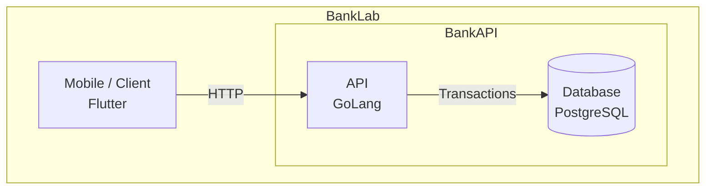

# Visão Geral da Aplicação

Este documento apresenta uma visão estruturada da API no seu estágio atual (24 de marco de 2026) de implementação. O objetivo é servir como material de entendimento para desenvolvedores que precisam estudar o sistema, manter funcionalidades existentes ou implementar novas capacidades com coerência em relação à arquitetura adotada.

A API foi construída em Go e integra um core bancário simplificado dentro do projeto `banklab`. Embora o escopo atual ainda seja relativamente contido, a aplicação já implementa conceitos importantes de autenticação, autorização, onboarding de usuário, gestão de cliente, criação e consulta de contas, além de operações financeiras como depósito, saque, transferência e extrato.

Por lidar com regras de domínio mais sensíveis do que um CRUD convencional, a aplicação foi organizada para separar claramente responsabilidades entre camadas e módulos. Essa separação busca preservar consistência de regras, reduzir acoplamento entre partes do sistema e tornar o código mais legível, testável e evolutivo.

Este material não substitui a leitura do código nem a documentação técnica específica de cada área. Seu papel é oferecer uma leitura orientada da aplicação: explicar como o sistema está organizado, quais decisões arquiteturais já foram tomadas, onde cada responsabilidade está localizada e como os principais fluxos se relacionam.

Ao longo do documento, serão abordados:

- o objetivo e o escopo atual da API;
- o estilo arquitetural adotado;
- a organização por módulos e camadas;
- o ciclo de uma requisição dentro do sistema;
- a superfície REST exposta pela aplicação;
- o papel da autenticação e do contexto do usuário;
- fluxos importantes já implementados;
- decisões relevantes de modelagem e persistência;
- a estratégia de testes e documentação;
- os trade-offs e as possibilidades de evolução.

A intenção é que, ao final da leitura, um novo desenvolvedor consiga responder com mais clareza perguntas como:

- o que esta aplicação faz hoje?
- como o código está organizado?
- onde uma nova regra deve ser implementada?
- quais módulos são responsáveis por cada parte do domínio?
- como autenticação, autorização e ownership influenciam os fluxos?
- quais cuidados arquiteturais precisam ser preservados ao evoluir o sistema?

A API deve ser entendida, neste momento, como um monolito modular com separação em camadas. Essa escolha permite manter simplicidade operacional sem abrir mão de organização interna. Ela também cria uma base sólida para evolução incremental, preservando consistência em fluxos críticos e clareza na distribuição das responsabilidades.

## Licença MIT

A escolha da licença MIT reflete a intenção de manter o projeto aberto e acessível, sem impor restrições sobre seu uso futuro.

Por se tratar de uma aplicação com características de fintech, optou-se por uma licença permissiva, permitindo que o código seja estudado, modificado e reutilizado em diferentes contextos — inclusive comerciais — sem a obrigatoriedade de abertura de código derivado, como ocorre em licenças copyleft (ex: GPL).

Essa decisão oferece maior flexibilidade para evolução do projeto, tanto no contexto acadêmico quanto em possíveis aplicações práticas, incluindo a base para novos produtos ou serviços.

Além disso, a licença MIT mantém a responsabilidade limitada dos autores, deixando explícito que o software é fornecido “como está”, sem garantias, o que é particularmente relevante em sistemas que envolvem regras financeiras.