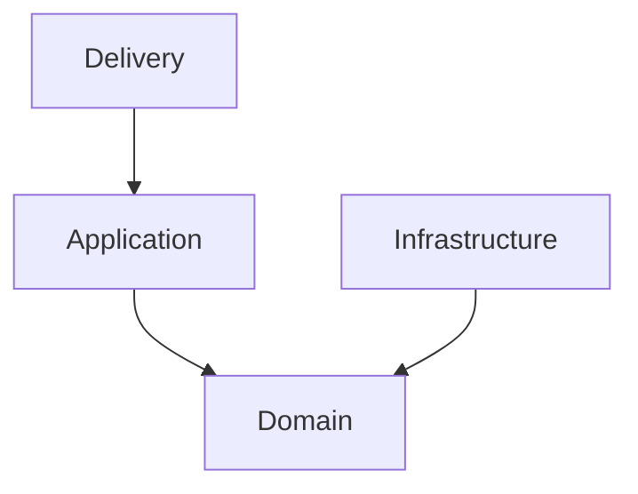
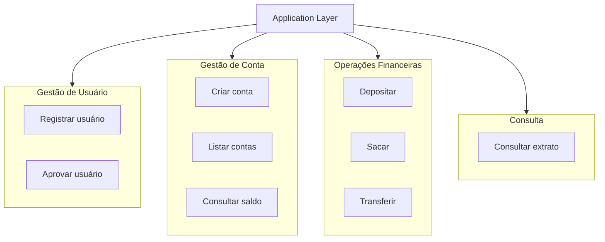

# Estilo Arquitetural Adotado

Este capítulo descreve o estilo arquitetural da API e explica o que essa escolha significa na prática para o desenvolvimento e evolução do sistema. O objetivo não é apenas nomear a arquitetura, mas deixar claro como ela organiza o código, como distribui responsabilidades e quais decisões de acoplamento ela procura evitar.

## Visão geral

A API adota um modelo de **monolito modular com separação em camadas**.

Isso significa que:

- a aplicação é executada como um único serviço;
- o código é dividido por módulos de negócio;
- cada módulo organiza seu código interno em camadas com responsabilidades distintas.

Em termos práticos, não se trata de uma arquitetura distribuída em microsserviços, mas também não se trata de um monolito desorganizado em que todas as responsabilidades ficam misturadas. O sistema busca um ponto de equilíbrio: simplicidade operacional no runtime e clareza arquitetural dentro do código.

## Monolito modular

O termo *monolito* indica que a aplicação é executada como um único processo principal, com um único ponto de inicialização e, no estágio atual, com dependência central de um mesmo banco PostgreSQL.

O termo *modular* indica que esse único sistema não está estruturado como uma massa única de código. Em vez disso, ele é separado em áreas de responsabilidade alinhadas ao domínio, como:

- `auth`;
- `account`;
- `customer`;
- `admin`.

Cada módulo concentra regras, casos de uso, contratos e adaptações técnicas relacionadas ao seu próprio contexto funcional.

Essa organização melhora legibilidade e manutenção porque permite responder com mais clareza perguntas como:

- em qual módulo essa funcionalidade pertence?
- quem é dono dessa regra?
- essa validação diz respeito a autenticação, conta, customer ou administração?

## Arquitetura em camadas

Dentro dos módulos, o sistema usa uma divisão em camadas:

Essa direção indica como as dependências devem se comportar.

A camada `delivery` depende da `application`, porque sua responsabilidade é receber a requisição e acionar um caso de uso.

A camada `application` depende do `domain`, porque utiliza entidades, regras e contratos do domínio para executar o fluxo da operação.

A camada `infrastructure` também depende do `domain`, porque implementa contratos definidos pelas camadas internas, como interfaces de repositório.

O `domain`, por sua vez, não depende das outras camadas. Ele representa o núcleo conceitual do sistema e deve permanecer isolado de detalhes técnicos.

## Significado da direção de dependência

A direção das dependências é um dos elementos mais importantes dessa arquitetura.

Ela significa que o sistema tenta impedir que detalhes externos contaminem o núcleo do domínio.

Por exemplo:

- uma entidade de conta não deve depender de `net/http`;
- uma regra de saldo insuficiente não deve depender de SQL;
- uma política de conta não deve depender de `pgx`;
- um erro de domínio não deve depender de JSON ou framework web.

Isso não significa que o sistema ignora infraestrutura. Significa apenas que infraestrutura deve ser tratada como detalhe de implementação e não como definidora das regras principais do negócio.

## O que cada camada representa

### Delivery

A camada `delivery` representa a borda de entrada HTTP da aplicação.

Ela é responsável por:

- ler requisições;
- decodificar JSON;
- interpretar path params e query params;
- extrair o usuário autenticado do contexto;
- chamar o caso de uso correto;
- converter resultados e erros para respostas HTTP.

Essa camada lida com protocolo, formato e adaptação. Ela não é dona da regra de negócio principal.

### Application

A camada `application` representa os casos de uso do sistema.

Ela é responsável por:

- coordenar fluxos de negócio;
- aplicar validações de aplicação;
- usar contratos de repositório;
- controlar transações quando necessário;
- combinar regras de múltiplos módulos quando um fluxo exige orquestração.

É na `application` que o sistema expressa ações como:

Na camada `application`, essas capacidades são organizadas em torno dos principais fluxos do sistema:

### Domain

A camada `domain` representa o núcleo de conceitos e regras do sistema.

Ela é responsável por:

- definir entidades;
- expressar invariantes;
- declarar erros de negócio;
- declarar contratos como interfaces de repositório;
- centralizar regras fundamentais do domínio.

O domínio deve ser a parte mais estável da aplicação. Ele responde à pergunta: 

>  *o que é verdadeiro para o negócio, independentemente de HTTP, banco ou framework?*

### Infrastructure

A camada `infrastructure` representa a implementação técnica concreta.

Ela é responsável por:

- executar queries SQL;
- integrar com PostgreSQL;
- implementar repositórios;
- mapear dados persistidos;
- lidar com transações e locks;
- integrar com mecanismos como JWT e hashing.

Essa camada conhece bibliotecas e drivers. Ela torna possível executar o sistema real, mas não define sozinha o comportamento de negócio.

## Consequência prática para desenvolvimento

Para trabalhar bem nesse projeto, é importante preservar a separação já adotada entre módulos e camadas.

Na prática, isso significa:

- manter HTTP e contrato externo em `delivery`;
- concentrar fluxo e orquestração em `application`;
- manter regras e contratos no `domain`;
- deixar persistência e detalhes técnicos em `infrastructure`.

Também significa evitar que um módulo assuma regras que pertencem a outro. O valor dessa arquitetura está justamente em tornar mais claro onde cada decisão deve ficar.

## Síntese

O estilo arquitetural da API combina simplicidade operacional com organização interna orientada a domínio.

O sistema roda como uma única aplicação, mas separa responsabilidades por módulos de negócio e por camadas. Essa escolha ajuda a reduzir acoplamento, melhora a leitura do código e torna mais previsível o local de implementação de cada mudança.

Para novos desenvolvedores, esse capítulo deve funcionar como referência para interpretar o projeto: entender quem depende de quem, o que cada camada representa e por que a separação interna da aplicação precisa ser preservada.
