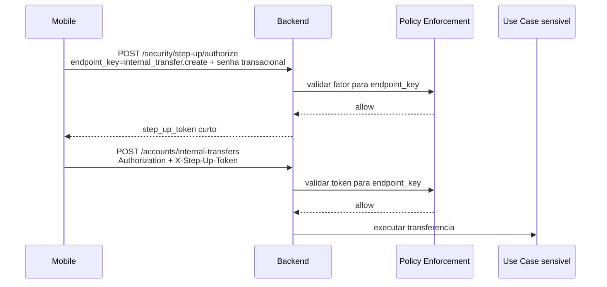

# Backlog: ZTA MVP - fundação e decisões

## 1. Contexto

O BankLab já possui autenticação via JWT e autorização por papel, propriedade e
estado do usuário. O próximo passo é introduzir uma camada de decisão por
operação sensível, inspirada em Zero Trust Architecture.

Este backlog é o guarda-chuva da evolução ZTA do MVP. Ele registra as decisões
arquiteturais e direciona os backlogs menores que implementam cada parte.

## 2. Objetivo

Criar a base conceitual e arquitetural para o primeiro incremento de ZTA:

- senha transacional como primeiro fator;
- step-up token curto;
- enforcement antes do use case sensível;
- proteção inicial da transferência interna.

## 3. Backlogs derivados

- [006a - transaction-password.md](<006a - transaction-password.md>): criação da
  senha transacional, PIN, hash, tentativas e bloqueio.
- [006b - step-up-token.md](<006b - step-up-token.md>): autorização de step-up,
  emissão de token, persistência de `jti` e consumo único.
- [006c - internal-transfer-step-up-enforcement.md](<006c - internal-transfer-step-up-enforcement.md>):
  aplicação do enforcement em transferência interna.
- [006d - zta-contracts-and-docs.md](<006d - zta-contracts-and-docs.md>):
  contratos HTTP, erros, documentação e alinhamento mobile/API.

## 4. Decisões arquiteturais

O ZTA MVP deve nascer como um módulo próprio:

```text
internal/security/
  domain/
  application/
  infrastructure/
  delivery/
```

Responsabilidades:

- `auth`: autenticação, sessão e identidade autenticada;
- `security`: senha transacional, step-up, policy enforcement e fatores de
  confiança.

No MVP, o enforcement será chamado explicitamente pelos endpoints sensíveis.
Com a evolução do ZTA, a tendência é que todas as rotas passem por avaliação de
política, ainda que endpoints comuns recebam políticas mais simples.

## 5. Fluxo geral

O diagrama abaixo é uma visão geral. A coluna Backend representa a entrada HTTP
da API. No endpoint de step-up, ela tende a ser `internal/security/delivery`. No
endpoint sensível, ela tende a ser a delivery do módulo protegido, como
`internal/account/transaction/delivery`.



Fluxo simplificado:

```text
Delivery HTTP
  -> Policy Enforcement Point
    -> Policy Engine
      -> Transaction Password Factor
  -> Application Use Case
```

## 6. Nomes definidos

```text
Endpoint de criação da senha transacional:
POST /security/transaction-password

Endpoint de autorização de step-up:
POST /security/step-up/authorize

Endpoint sensível protegido no primeiro corte:
POST /accounts/internal-transfers

Header do token de step-up:
X-Step-Up-Token

Endpoint lógico:
internal_transfer.create
```

## 7. Fora de escopo do MVP

- identificação de dispositivo;
- registro de dispositivo confiável;
- prova de vida;
- biometria;
- score de risco;
- integração com provedor externo;
- política dinâmica configurável por admin;
- bloqueio definitivo por suspeita de comprometimento;
- recuperação completa de senha transacional;
- troca de senha transacional;
- reset de senha transacional;
- vinculação do step-up token ao payload da operação.

## 8. Evolução futura

Depois do MVP, o módulo `security` poderá incluir:

- dispositivo confiável;
- prova de vida;
- biometria local;
- histórico de sessão;
- sinais de risco;
- política diferenciada por tipo, valor e contexto da operação;
- vinculação do step-up token à intenção detalhada da operação para fluxos de
  maior risco.

